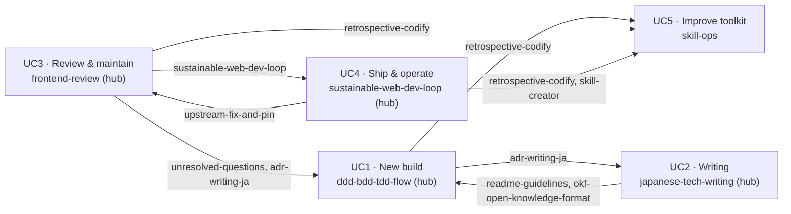

# skills

個人用の Claude Code エージェントスキル集。
リポジトリ全体に共通のライセンスはない。
スキルごとにライセンスがあり、下の[全スキル](#全スキルaz)の表の License 列に記す（`skills/<skill-name>/LICENSE` を参照）。
*derivative*（派生版）と記したスキルは、変更を加えた再配布である。
元の著作物、そのライセンス、変更点は、各スキルの README と LICENSE に記す。

リポジトリは**フラット**で、スキルごとに `skills/<skill-name>/` のディレクトリを 1 つ置き、カテゴリのサブディレクトリは持たない。
分類はディレクトリ構成に表さない。
スキルは `~/.claude/skills/<skill-name>/` に 1 本ずつインストールされるので、分類を木に表しても実行時の意味がないからだ。
代わりに、このファイルでスキルを**ユースケース**ごとにまとめる。
ユースケースは、後述するスキル連携のマルコフモデルから導く。

## インストール

**gh skill**（推奨）:

```bash
gh skill add krkrkrr/skills
```

更新するには:

```bash
gh skill update krkrkrr/skills
```

**apm**（`apm.yml`）:

```yaml
dependencies:
  apm:
    - krkrkrr/skills/skills/<skill-name>
```

**skills:**

```bash
npx skills add krkrkrr/skills
```

**手動（1 本だけ）:**

```bash
cp -rT skills/<skill-name>/ ~/.claude/skills/<skill-name>/
```

---

## ユースケースマップ

スキルは技術領域ではなく、**何をしようとしているか**でまとめる。
まとめ方は、スキル連携のマルコフ連鎖モデルから導く。
各スキルを**状態**、「次にどのスキルを呼ぶか」を**遷移**とし、モデルの連結したまとまりを端から端までのユースケースとみなす。
複数のワークフローの境目にあるスキルがあるので、このマップは分割ではなく**被覆**である。
**橋渡し**のスキル（`↔ UCx` の印を付ける）は、複数のユースケースに現れる。
所属は、そのスキルへの主な流入遷移で決める。
遷移は、各スキルが `SKILL.md` と `references/` で名指しする受け渡し（Related の節や、他スキルへの本文中の案内）から読み取る。



### UC1：新しいアプリや機能を作る

要件から、モデリング、テスト、実装までを通して機能を作る。
**ハブ**：`ddd-bdd-tdd-flow`
**成果物**：通る E2E テスト。

- [ddd-bdd-tdd-flow](./skills/ddd-bdd-tdd-flow/)：境界づけられたコンテキストの見定めから、DDD の SUDO モデリング、BDD、プロパティテスト、TDD まで
- [unresolved-questions](./skills/unresolved-questions/)：`ddd-bdd-tdd-flow` の増分で決着しなかったことを、1 問 1 ファイルで記録する
- [external-api-tos-check](./skills/external-api-tos-check/)：外部 API を組み込む前に、その利用規約で許されているか確かめる
- [adr-writing-ja](./skills/adr-writing-ja/) `↔ UC2`：設計上の決定を日本語の ADR として記録する
- [playwright-test](./skills/playwright-test/) `↔ UC3`：E2E テストを書き、構成する
- [playwright-cli](./skills/playwright-cli/)：ブラウザを対話的に操作する
- [okf-open-knowledge-format](./skills/okf-open-knowledge-format/) `↔ UC3`：`doc/`、問い、ADR を、ほかのエージェントや道具が読める OKF 形式で書く。バンドルを作り、検証する

### UC2：技術文書を書いて仕上げる

記事、書籍原稿、設計記録の下書きを書き、公開前に論証を引き締める。
**ハブ**：`japanese-tech-writing`
**成果物**：論証を点検した原稿。

- [japanese-tech-writing](./skills/japanese-tech-writing/)：日本語の技術文書の文章規範
- [argument-gap-edit](./skills/argument-gap-edit/)：無理のある議論や構成上のギャップを直す
- [adr-writing-ja](./skills/adr-writing-ja/) `↔ UC1`：日本語の ADR を書き、`argument-gap-edit` で論証を点検する
- [extract-glossary](./skills/extract-glossary/) `↔ UC3`：repo からドメインの用語集とオンボーディング用の構成図を、OKF バンドルとして作る
- [readme-guidelines](./skills/readme-guidelines/) `↔ UC1`：README のテンプレートと更新方針

### UC3：既存のコードベースを点検して保守する

受け継いだ、または自分が持つコードベースを監査し、重要なものから手を付け、依存を更新し続ける。
**ハブ**：`frontend-review`
**成果物**：指摘のレポートと、コミットした KPI の基準値。

- [frontend-review](./skills/frontend-review/)：フロントエンドの repo（CI、型と lint、依存、テスト、セキュリティ、状態管理、性能）を、締まる一方の KPI 基準値に照らして監査する
- [sustainable-web-dev-loop](./skills/sustainable-web-dev-loop/) `↔ UC4`：依存のレビュー、CVE のトリアージ、ライブラリの置き換え（`references/dependencies.md`）
- [upstream-fix-and-pin](./skills/upstream-fix-and-pin/)：上流に PR を出し、取り込まれるまで git の SHA で固定する
- [extract-glossary](./skills/extract-glossary/) `↔ UC2`：点検の前に、受け継いだコードベースの用語、repo、構成を整理する
- [playwright-test](./skills/playwright-test/) `↔ UC1`：`frontend-review` が勧める E2E の構成、シャーディング、リトライ、フレーキーなテストの扱い
- [okf-open-knowledge-format](./skills/okf-open-knowledge-format/) `↔ UC1`：`extract-glossary` の知識ベースと、コミットする点検レポートの形式。バンドルを検証する

### UC4：サービスの成長に耐えて出荷し運用する

CI のゲート、デプロイ、可観測性、移行を形づくり、品質が削られずに締まっていくようにする。
**ハブ**：`sustainable-web-dev-loop`
**成果物**：悪化したら落ちるゲートと基準値。

- [sustainable-web-dev-loop](./skills/sustainable-web-dev-loop/) `↔ UC3`：測る、基準値を締める、繰り返しを仕組みに昇格させる。デプロイとロールバック、CI、データ層、OpenTelemetry の既定

### UC5：スキル集そのものを運用して改善する

新しいスキルを作り、evals でテストし、学びをルールとして戻す。
連鎖が最後に折り返してくる、自己改善のループである。

- [skill-creator](./skills/skill-creator/)：新しいスキルの下書きを作り、evals とベンチマークで改善を重ねる
- [retrospective-codify](./skills/retrospective-codify/)：試行錯誤を ast-grep ルール、スキル、CLAUDE.md のルールにする

---

## 全スキル（A–Z）

すべてのスキルの一覧。
ここにあるスキルは、上のユースケースのどれかに必ず現れる。

| スキル | 説明 | 参照元 | ライセンス |
|-------|-------------|-----------|---------|
| [adr-writing-ja](./skills/adr-writing-ja/) | 日本語の ADR を書く。ADR にすべきかの判断、置き場所と命名、11 種類のテンプレート、`argument-gap-edit` による論証の点検。 | [architecture-decision-record](https://github.com/architecture-decision-record/architecture-decision-record#claude-code-skills-for-adrs) | CC BY-NC-SA 4.0 |
| [argument-gap-edit](./skills/argument-gap-edit/) | 日本語の技術原稿で、無理のある議論、構成上のギャップ、流れを乱す内容を見つけて直す。 | [k16shikano/SKILL.md](https://gist.github.com/k16shikano/fd287c3133457c4fd8f5601d34aa817d?permalink_comment_id=6201959#gistcomment-6201959) | Unlicense |
| [ddd-bdd-tdd-flow](./skills/ddd-bdd-tdd-flow/) | 新しい機能やアプリを、DDD、BDD、TDD の順で作る流れ。repo の境界づけられたコンテキストの見定め（フェーズ 0）、SUDO によるドメインモデリング、Gherkin のフィーチャー、プロパティベーステスト、t_wada 流の TDD による実装。 | original | Unlicense |
| [external-api-tos-check](./skills/external-api-tos-check/) | 外部の API、SDK、サービスの利用規約が、予定している挙動を許しているかを実装前に確かめ、制約を ADR に記録する。 | original | Unlicense |
| [extract-glossary](./skills/extract-glossary/) | repo や GitHub の organization から、ドメイン固有の用語、技術スタック、オンボーディング用の Mermaid 図を抽出し、OKF のナレッジバンドル（用語、repo、構成の観点ごとに 1 概念）にする。 | [mizchi/skills](https://github.com/mizchi/skills) | MIT |
| [frontend-review](./skills/frontend-review/) | 既存のフロントエンドの repo を監査する。現状把握、CI、型と lint、依存と CVE、テスト、セキュリティ、状態管理、描画性能を、締まる一方の KPI 基準値とともに扱う。 | derivative（スキルの README を参照） | MIT |
| [japanese-tech-writing](./skills/japanese-tech-writing/) | 日本語の技術文書を書き、推敲するための指針。明快な構成、厳密な論証、一貫した整形、簡潔で読みやすい文章。 | [k16shikano/SKILL.md](https://gist.github.com/k16shikano/fd287c3133457c4fd8f5601d34aa817d#file-skill-md) | Unlicense |
| [okf-open-knowledge-format](./skills/okf-open-knowledge-format/) | Open Knowledge Format（OKF）のバンドルを作り、検証し、充実させる。OKF は、人とエージェントが交換できる、YAML frontmatter 付きの Markdown の形式である。このライブラリでナレッジを書き出すスキルは、この形式で書く。 | [fabricioctelles/skills](https://github.com/fabricioctelles/skills/tree/3b8da2cc1d5d13da7142560433b46b7ec3fc6988/skills/okf-open-knowledge-format) | Apache-2.0 |
| [playwright-cli](./skills/playwright-cli/) | Playwright CLI のコマンドを対話的に実行する。 | [microsoft/playwright](https://github.com/microsoft/playwright/tree/e125b2ff24ad285b22e595f4e01a14f038b2c800/packages/playwright-core/src/tools/skills/playwright-cli) | Apache-2.0 |
| [playwright-test](./skills/playwright-test/) | Playwright Test の実践集。固定時間の wait を避ける、ネットワークを契機に待つ、ドラッグ＆ドロップ、GitHub Actions でのシャードとリトライ。 | derivative（スキルの README を参照） | MIT |
| [readme-guidelines](./skills/readme-guidelines/) | README.md のテンプレートと方針。プロジェクトの種類によるテンプレートの選択、README-ja.md の同期、変更と更新すべき節の対応。 | original | Unlicense |
| [retrospective-codify](./skills/retrospective-codify/) | 修正が通ったあとで、試行錯誤から得た学びを ast-grep ルール、スキル、CLAUDE.md のルールにする。 | derivative（スキルの README を参照） | MIT |
| [skill-creator](./skills/skill-creator/) | 新しいスキルを作り、evals とベンチマークで改善し、発火の精度が上がるよう description を最適化する。 | [anthropics/skills](https://github.com/anthropics/skills/tree/main/skills/skill-creator) | Apache-2.0 |
| [sustainable-web-dev-loop](./skills/sustainable-web-dev-loop/) | 成長する Web サービスを出荷し運用するための原則と既定。測る、基準値を締める、繰り返す指摘を仕組みに昇格させる。デプロイとロールバック、CI、データ層、依存、OpenTelemetry。 | derivative（スキルの README を参照） | MIT |
| [unresolved-questions](./skills/unresolved-questions/) | 分からないこと、根拠の弱い暫定の決定、あえて手を付けなかった作業を、`doc/questions/<status>/` の下に 1 問 1 つの OKF 概念として記録する。ディレクトリがそのまま状態を表す。 | original | Unlicense |
| [upstream-fix-and-pin](./skills/upstream-fix-and-pin/) | 上流のライブラリのバグを直して PR を出し、取り込まれるまで git の SHA で固定する。 | derivative（スキルの README を参照） | MIT |

---

## この README の保守

ディレクトリ構成には分類がないので、このファイルがスキル集の唯一の地図である。
**スキルを変えたら、同じコミットでこの README も更新する。**
詳しい規則と、ディレクトリと README の整合チェックは、[CLAUDE.md](./CLAUDE.md) の「README Maintenance」の節にある。
