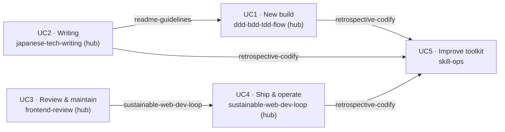

# skills

Personal Claude Code agent skills library. There is no single repository-wide
license: each skill carries its own, listed in the License column of the
[All skills](#all-skills-az) table below (see `skills/<skill-name>/LICENSE`).

The repository is **flat** — one directory per skill at `skills/<skill-name>/`,
with no category subdirectories. Grouping is not encoded in the tree (it would
have no runtime meaning, since skills install individually into
`~/.claude/skills/<skill-name>/`). Instead, skills are organized here by **use
case**, derived from the skill-collaboration Markov model described below.

## Install

**gh skill** (recommended):

```bash
gh skill add krkrkrr/skills
```

To update:

```bash
gh skill update krkrkrr/skills
```

**apm** (`apm.yml`):

```yaml
dependencies:
  apm:
    - krkrkrr/skills/skills/<skill-name>
```

**skills:**

```bash
npx skills add krkrkrr/skills
```

**Manual (single skill):**

```bash
cp -r skills/<skill-name>/ ~/.claude/skills/<skill-name>/
```

---

## Use-case map

Skills are grouped by **what you are trying to do**, not by technical domain.
The grouping is derived from a Markov-chain model of skill collaboration: each
skill is a *state*, "which skill you invoke next" is a *transition*, and the
model's connected clusters correspond to end-to-end use cases. Because some
skills sit on the boundary between workflows, this map is a **cover, not a
partition** — a *bridge* skill (tagged `↔ UCx`) appears under more than one use
case. Membership is assigned by the skill's dominant inbound transitions.



### UC1 — Build a new app or feature（新規開発を立ち上げる）

Take a feature from requirements through modeling, tests, and implementation.
**Hub:** `ddd-bdd-tdd-flow` · **Deliverable:** passing E2E tests.

- [ddd-bdd-tdd-flow](./skills/ddd-bdd-tdd-flow/) — orient into bounded contexts → DDD SUDO modeling → BDD → property tests → TDD
- [unresolved-questions](./skills/unresolved-questions/) — file what a `ddd-bdd-tdd-flow` increment can't settle, as one question per file
- [external-api-tos-check](./skills/external-api-tos-check/) — clear a third-party API's ToS before integrating
- [adr-writing-ja](./skills/adr-writing-ja/) `↔ UC2` — record a design decision as a Japanese ADR
- [playwright-test](./skills/playwright-test/) — write/structure E2E tests
- [playwright-cli](./skills/playwright-cli/) — drive the browser interactively

### UC2 — Author & polish technical writing（技術文書を書いて仕上げる）

Draft an article, book manuscript, or design record, and tighten its reasoning before publishing.
**Hub:** `japanese-tech-writing` · **Deliverable:** an argument-checked draft.

- [japanese-tech-writing](./skills/japanese-tech-writing/) — Japanese technical-writing norms
- [argument-gap-edit](./skills/argument-gap-edit/) — fix weak arguments and structural gaps
- [adr-writing-ja](./skills/adr-writing-ja/) `↔ UC1` — Japanese ADRs, argument-checked with `argument-gap-edit`
- [extract-glossary](./skills/extract-glossary/) `↔ UC3` — build a domain glossary / onboarding map from a repo
- [readme-guidelines](./skills/readme-guidelines/) `↔ UC1` — README templates and update policy

### UC3 — Review & maintain an existing codebase（既存コードを点検して保守する）

Audit a codebase you inherited or own, triage what matters, and keep its dependencies moving.
**Hub:** `frontend-review` · **Deliverable:** a findings report plus a committed KPI baseline.

- [frontend-review](./skills/frontend-review/) — audit a frontend repo (CI, hygiene, deps, tests, security, state, perf) against a ratcheting KPI baseline
- [sustainable-web-dev-loop](./skills/sustainable-web-dev-loop/) `↔ UC4` — dependency review, CVE triage, and library replacement (`references/dependencies.md`)
- [upstream-fix-and-pin](./skills/upstream-fix-and-pin/) — PR upstream and pin to a git SHA meanwhile
- [extract-glossary](./skills/extract-glossary/) `↔ UC2` — map the terms, repos, and architecture of an inherited codebase before reviewing it

### UC4 — Ship & operate as the service grows（成長に耐えて出荷・運用する）

Shape CI gates, deploys, observability, and migrations so quality ratchets up instead of eroding.
**Hub:** `sustainable-web-dev-loop` · **Deliverable:** gates and baselines that fail on regression.

- [sustainable-web-dev-loop](./skills/sustainable-web-dev-loop/) `↔ UC3` — measure → ratchet → promote repeats into mechanisms; deploy/rollback, CI, data-layer, and OpenTelemetry defaults
- [playwright-test](./skills/playwright-test/) `↔ UC1` — E2E sharding, retries, and flaky handling in CI

### UC5 — Operate & improve the toolkit（スキル自体を運用・自己改善する）

Build new skills, test them with evals, and feed lessons back as rules.
This is the self-improvement loop the chain folds back into.

- [skill-creator](./skills/skill-creator/) — draft a new skill, then iterate on it with evals and benchmarks
- [retrospective-codify](./skills/retrospective-codify/) — turn trial-and-error into ast-grep rules / skills / CLAUDE.md

---

## All skills (A–Z)

The complete inventory. Every skill here appears under at least one use case above.

| Skill | Description | Reference | License |
|-------|-------------|-----------|---------|
| [adr-writing-ja](./skills/adr-writing-ja/) | Write Japanese ADRs — whether one is needed, placement and naming, eleven templates, and an argument check via `argument-gap-edit`. | [architecture-decision-record](https://github.com/architecture-decision-record/architecture-decision-record#claude-code-skills-for-adrs) | CC BY-NC-SA 4.0 |
| [argument-gap-edit](./skills/argument-gap-edit/) | Detects and fixes weak arguments, structural gaps, and disruptive content in Japanese technical manuscripts. | [k16shikano/SKILL.md](https://gist.github.com/k16shikano/fd287c3133457c4fd8f5601d34aa817d?permalink_comment_id=6201959#gistcomment-6201959) | Unlicense |
| [ddd-bdd-tdd-flow](./skills/ddd-bdd-tdd-flow/) | Structured DDD → BDD → TDD flow for a new feature or app — orient into the repo's bounded contexts (Phase 0), SUDO domain modeling, Gherkin features, property-based tests, and t_wada TDD implementation. | original | Unlicense |
| [external-api-tos-check](./skills/external-api-tos-check/) | Confirms a third-party API/SDK/service's Terms of Service allows the planned behavior before implementation, and records constraints as an ADR. | original | Unlicense |
| [extract-glossary](./skills/extract-glossary/) | Extract domain-specific terminology, tech stacks, and onboarding Mermaid diagrams from a repo or GitHub org. | [mizchi/skills](https://github.com/mizchi/skills) | MIT |
| [frontend-review](./skills/frontend-review/) | Audit an existing frontend repo — triage, CI, hygiene, dependencies/CVEs, testing, security, state management, rendering performance — with a KPI baseline that only ratchets tighter. | [mizchi/skills](https://github.com/mizchi/skills/tree/a3f2f1bac20fc500c2688ffe6ca4ce048d0cfedc) | MIT |
| [japanese-tech-writing](./skills/japanese-tech-writing/) | Guidelines for writing and editing Japanese technical documentation with clear structure, rigorous reasoning, consistent formatting, and concise, readable prose. | [k16shikano/SKILL.md](https://gist.github.com/k16shikano/fd287c3133457c4fd8f5601d34aa817d#file-skill-md) | Unlicense |
| [playwright-cli](./skills/playwright-cli/) | Run Playwright CLI commands interactively. | [microsoft/playwright](https://github.com/microsoft/playwright/tree/e125b2ff24ad285b22e595f4e01a14f038b2c800/packages/playwright-core/src/tools/skills/playwright-cli) | Apache-2.0 |
| [playwright-test](./skills/playwright-test/) | Best practices for Playwright Test — avoiding fixed waits, network triggers, DnD, shard/retry on GitHub Actions. | [mizchi/skills](https://github.com/mizchi/skills) | MIT |
| [readme-guidelines](./skills/readme-guidelines/) | README.md templates and policies — template selection by project type, README-ja.md sync, and change-to-section update rules. | original | Unlicense |
| [retrospective-codify](./skills/retrospective-codify/) | Codify trial-and-error lessons into ast-grep rules, skills, or CLAUDE.md rules after a fix lands. | [mizchi/skills](https://github.com/mizchi/skills) | MIT |
| [skill-creator](./skills/skill-creator/) | Create new skills, iterate on them with evals/benchmarks, and optimize a skill's description for triggering accuracy. | [anthropics/skills](https://github.com/anthropics/skills/tree/main/skills/skill-creator) | Apache-2.0 |
| [sustainable-web-dev-loop](./skills/sustainable-web-dev-loop/) | Principles and defaults for shipping and operating a growing web service — measure, ratchet baselines, promote repeated findings into mechanisms; deploy/rollback, CI, data layer, dependencies, OpenTelemetry. | [mizchi/skills](https://github.com/mizchi/skills/tree/a3f2f1bac20fc500c2688ffe6ca4ce048d0cfedc) | MIT |
| [unresolved-questions](./skills/unresolved-questions/) | Files unknowns, provisional decisions, and deliberately-skipped work as one question per file under `doc/questions/<status>/`, where the directory is the status. | original | Unlicense |
| [upstream-fix-and-pin](./skills/upstream-fix-and-pin/) | Fix an upstream library bug, open a PR, and pin to the git SHA while waiting for it to merge. | [mizchi/skills](https://github.com/mizchi/skills) | MIT |

---

## Maintaining this README

The directory tree has no categorization, so this file is the single map of the
library. **Any skill change must update this README in the same commit** — see
the "README Maintenance" section in [CLAUDE.md](./CLAUDE.md) for the exact rules
and a tree ⇄ README consistency check.
