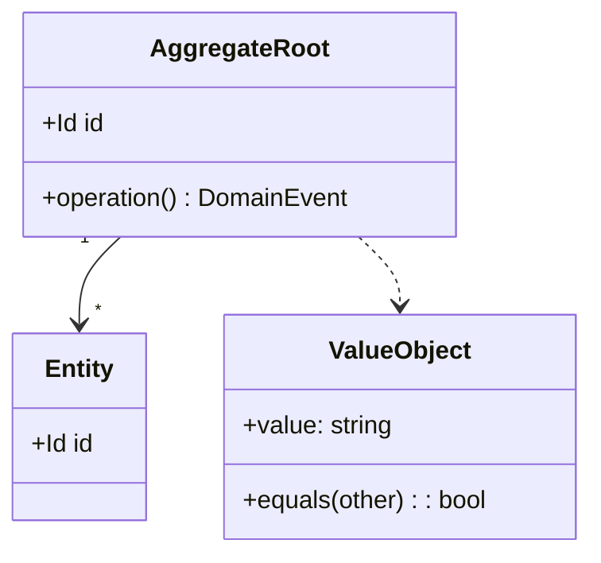
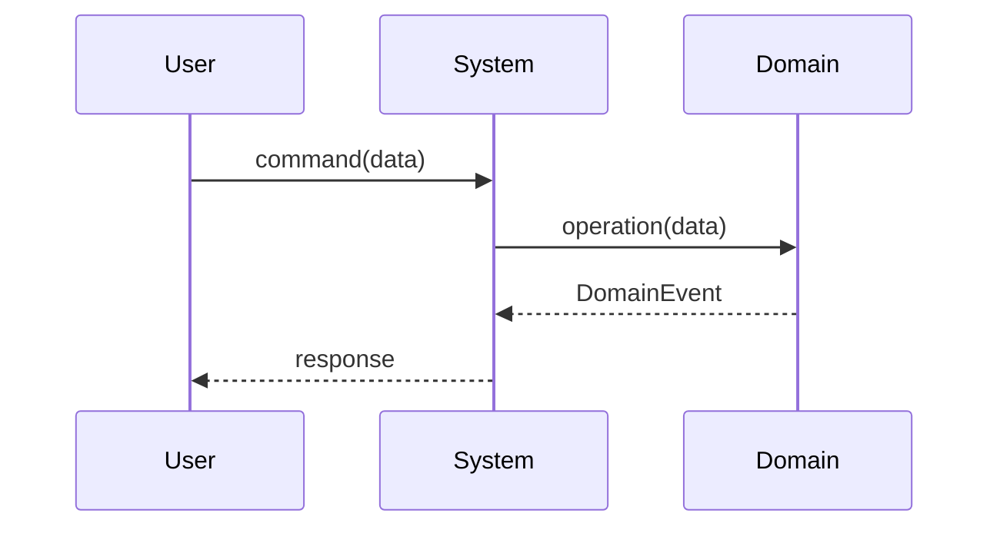

# DDD → BDD → TDD 開発フロー

各フェーズを必ず順番通りに実施する。**ユーザーの承認なしに次のフェーズへ進んではならない。**

---

## フェーズ 0: どのコンテキストの話か決める

**ヒアリングの前にやる。** 次の順に読む。

1. `doc/README.md` — 索引
2. `doc/system-context.md` — どのコンテキストが在り、翻訳器がどこに置かれているか
3. `doc/glossary.md` — ユビキタス言語
4. `doc/questions/open/` と `doc/questions/deferred/` — すでに「分からない」と
   分かっていること、および**意図的に触っていない**こと

そのうえで 1 つだけ答える。**この作業は既存のどのコンテキストに属するか。**

> **既定の答えは「既存のどれか」である。**
> 新しいコンテキストを作るには、**ユビキタス言語が実際に違うこと**を示す ADR が要る。
> 同じ語が別の意味になるか、境界に翻訳器（腐敗防止層）を置く必要があるか。
> **「新しい機能だから」は理由にならない。**
> フィーチャーは仕事の増分であって、ドメインの単位ではない。

1 つのフィーチャーは**たいてい複数のコンテキストに跨がる。** それが普通である。
コンテキストごとに切って、それぞれの家へ入れる。
**フィーチャーの名前を付けたディレクトリを作らない。**

答えは、フェーズ 1 で作る増分フォルダに記録する。

---

## どこに何を置くか

**ここを一度読めば、以降のフェーズはこれを前提にしている。** この形は恣意的ではない。
**ファイルごとに答えている問いが違い、同じ問いに答えるものが同じ場所に居る。**
だから見る場所が 1 つになり、直す場所も 1 つになる。

```
doc/
  system-context.md   S — 唯一のシステムコンテキスト図。**コンテキストの数はここから数える**
  use-cases.md        U — 唯一のユースケース一覧。ID は接頭辞を持つ
  glossary.md         ユビキタス言語。単位と番兵もここ

  context/<コンテキスト>/           システムが話す相手ごとに 1 つ
    domain-model.md   D — この文脈の言語 / 集約 / 対応する src
    object-model.md   O — 担うユースケースと、やりとり
    constraints.md    守るべき規則 + 不変条件（担保するテストへのリンク付き）
    features/*.feature
```

ここから 2 つの規則が出る。**どちらも、この構成が防ごうとしている失敗そのもの**なので、
はっきり書いておく。

**S と U はリポジトリに 1 枚ずつ。** フェーズ 2 はそれを**更新する**。新しくは描かない。

**D・O・制約はコンテキストごとに 1 枚ずつ。** 集約ごとでも増分ごとでもない。
**3 つ開けばその文脈の設計が全部そろい、4 つ目がどこかに隠れていないと信じられること。**

これ以外は、設計ではないもの、モデルではなく記録、もらった資料のいずれかである。
**その部分の木は `references/layout-ja.md` にある。**

---

## フェーズ 1: 要件ヒアリング

構造化インタビューを実施する。すべての質問を先に行ってから次に進む。

### ドメイン & コンテキスト
- このアプリ/機能が解決したい課題は何か？
- 主要なユーザー（アクター）は誰か？
- コアドメインは何か？サポーティング・汎用サブドメインはあるか？
- 主要なビジネスルールと制約は何か？
- 完了条件（受け入れ基準）は何か？

### 技術コンテキスト
- 使用する技術スタックは何か？（言語・フレームワーク・DB など）
- 連携が必要な既存システムはあるか？
- 非機能要件: パフォーマンス・セキュリティ・スケール・可用性

収集した回答を **`doc/increments/<日付>-<名前>/requirements.md`** に保存する。

> ****他の増分の** `requirements.md` に上書きしない。** 増分の記録は増分ごとに残す。
>
> そのうえで、**中身を 4 つに割って本来の家へ配る。**
>
> | 中身 | 行き先 | なぜ |
> |---|---|---|
> | 実機で測ったこと | `doc/evidence/` | **追記のみ。訂正は新しい行で** |
> | 守るべき規則 | `doc/context/<bc>/constraints.md` へ**追記** | 改訂される。古い版は無効 |
> | 受け入れ基準 | フェーズ 3 の `.feature` | 実装後は不変 |
> | 未解決の問い | `doc/questions/open/<主題>/` に 1 問 1 ファイル | **状態はディレクトリが持つ** |
> | 新しい用語 | `doc/glossary.md` へ**追記** | **必ずここを通す** |

### 解けなかったことの記録

その場で決着しなかったもの — 分からないこと、決めなければならないから決めた数、
誰も触らなかったパラメータ — は `doc/questions/` へ、1 問 1 ファイルで置く。
**その進め方は `unresolved-questions` スキルが持つ。ここで書式を発明しない。**

このフェーズで大事なのは、**未解決をコードの `TODO` や `requirements.md` の
一文として持ち越さないこと。** 増分のフォルダは凍結されるので、
**その中に凍った問いは、未解決を探している人からは見えなくなる。**

**ブランチ作成 & 初回コミット**

フェーズ 1 の回答からフィーチャー名を kebab-case で導出する（例: 「ユーザー認証」 → `user-authentication`）。`doc/README.md` の年表に、この増分の行を足す（日付、名前、関わるコンテキスト、増分フォルダへのリンク、Status `Phase 1 complete`）。ルートの `README.md` は、リポジトリにまだないときだけ作る（下記 **README.md ライフサイクル**）。その後:

```bash
git checkout -b feature/<new-feature-name>
git add doc/increments/ doc/glossary.md doc/questions/ doc/README.md
git commit -m "docs(phase1): add requirements for <new-feature-name>"
```

以降のすべての作業はこのブランチで行う。

---

## フェーズ 2: SUDO モデリング（DDD）

**S と U は新しく描かない。** リポジトリに 1 枚ずつしか無い。
`doc/system-context.md` と `doc/use-cases.md` を**更新する**。
**2 枚目のシステムコンテキスト図は欠陥である。**

D と O だけを描く。

| | どこへ |
|---|---|
| **D** | `doc/context/<bc>/domain-model.md` へ追記 |
| **O** | `doc/context/<bc>/object-model.md` へ追記 |

> **設計文書は S・U・D・O・制約 の 5 種類だけ。** S と U はリポジトリに 1 枚ずつ、
> D・O・制約 はコンテキストごとに 1 枚ずつ。
> **6 種類目を作らない。同じ種類の 2 枚目も作らない。**
> **1 つの文書が 1 つの問いに答える。**

> **コンテキストの数は S 図から読み取る。** **システム本体**に接している相手ごとに
> 1 つ、それだけである。**S 図に線が増えないなら、コンテキストは増えない。**

**次の見出しの下へ追記する。** 検査がこの見出しを読むので、独自の見出しを
立てた文書は `npm test` で落ちる。**ただし本当の理由は、どのコンテキストでも
同じものが同じ場所にある状態を保つためである。**

| ファイル | 見出し |
|---|---|
| `domain-model.md` | `## この文脈の言語` · `## 集約と値オブジェクト` · `## 対応する src` |
| `object-model.md` | `## この文脈が担うユースケース` · `## やりとり` |
| `constraints.md` | `## 守るべき規則` · `## 不変条件` |

どのファイルも `system-context.md` を指す。`object-model.md` は `use-cases.md` も指す。
**この 2 つが正本である。この文脈のぶんだけ再掲し、描き直さない。**

> **図のサイズは硬い制約である。**
> **1 枚 = 1 集約（D）または 1 ユースケース（O）。**
> **40 行または 7 クラスを超えたら割る。**
>
> 実測: 割らずに書いた D 図は 152 行 / 109 行 / 106 行になり、読めなくなった。

SUDO の意味:
- **S**ituation（状況・文脈）: 境界付きコンテキスト、サブドメイン、それらの関係
- **U**secase（ユースケース）: アクターとそのユースケース
- **D**omain model（ドメインモデル）: 集約・エンティティ・値オブジェクト・ドメインイベント
- **O**bject interaction（オブジェクト相互作用）: 各コアユースケースの主要なシーケンス/コラボレーション

### S — 状況 ・ U — ユースケース — **描かない。更新する**

どちらも既にリポジトリに 1 枚ずつ在る。**ここに雛形を置かないのは意図的である。**
雛形があると新しい図を描きたくなり、**新しい図こそが欠陥だからである。**

| | ファイル | フェーズ 2 で足すもの |
|---|---|---|
| **S** | `doc/system-context.md` | **本当に新しい外部の相手と話すようになったときだけ**、その線を足す。それは同時に、新しいコンテキストを立てる根拠でもある |
| **U** | `doc/use-cases.md` | 行を足す。**接頭辞つきで**（`DEV-` / `INT-` …） |

そのうえで `object-model.md` には**この文脈のぶんだけ再掲する。**
一覧の正本は `use-cases.md` に置いたままにする。**一覧が 2 つあれば、片方が古くなる。**

> 実測: 増分ごとに S を描いていたとき、同じ外部システムが 5 通りの名前で
> 現れていた（`LLM` / `LM Studio`、`URX22` / `UR-22C`）。**誰も気づかなかった。**
> 5 枚のうち 2 枚が並べて読まれたことが、一度も無かったからである。

### D — Domain Model

集約・エンティティ・値オブジェクト・ドメインイベントをモデル化する。



### O — Object Interaction

各コアユースケースのシーケンス図を描く。



**→ 4 枚のダイアグラムをユーザーに提示する。**
「このモデルはドメインを正確に表現していますか？不足や誤りはありますか？」と確認する。

ユーザーが明示的に承認するまでイテレーションを繰り返す。各フィードバックラウンドを `## レビューノート` セクションに追記する。

**承認後にコミット**

`doc/README.md` の年表で、この増分の行を `Phase 2 complete` にする。**ルートの `README.md` は 100 行以下に保つ。**

```bash
git add doc/context/ doc/system-context.md doc/use-cases.md doc/ADR/ doc/README.md
git commit -m "docs(phase2): add SUDO domain model"
```

---

## フェーズ 3: BDD フィーチャー記述

承認済みの SUDO モデルから Gherkin フィーチャーファイルを導出する。主要なユースケースごとに `doc/context/<bc>/features/` 配下に 1 つの `.feature` ファイルを作成する。

### カバレッジチェックリスト（すべてのユースケースで必須）

- [ ] ハッピーパス（正常系）
- [ ] 境界値
- [ ] エラー / 拒否ケース（異常系）
- [ ] ビジネスルール違反
- [ ] 並行処理・冪等性のエッジケース

### フィーチャーファイルテンプレート

`references/templates-ja.md` の Gherkin テンプレートを使う。`doc/context/<bc>/features/<use-case-name>.feature` に保存する。

**→ すべてのフィーチャーファイルをユーザーに提示する。**
「これらのシナリオは期待される振る舞いを完全に捉えていますか？不足しているケースはありますか？」と確認する。

ユーザーが明示的に承認するまでイテレーションを繰り返す。

**承認後にコミット**

`doc/README.md` の年表で、この増分の行を `Phase 3 complete` にし、追加・変更した `.feature` ファイルへのリンクを添える。

```bash
git add doc/context/ doc/README.md
git commit -m "docs(phase3): add BDD feature files"
```

---

## フェーズ 4: プロパティベーステスト

### 4a: プロパティの抽出

承認済みの各フィーチャーから不変条件とプロパティを導出する。`doc/context/<bc>/constraints.md` の `## 不変条件` へ**追記**する。

各シナリオに対して以下を問う:
- **事後条件不変量**: 「この操作の後、X は常に成立しなければならない」
- **否定不変量**: 「この操作は決して Y を生成してはならない」
- **ラウンドトリップ**: 「encode → decode すると元に戻る」
- **単調性**: 「アイテムを追加すると常に件数が増える」
- **冪等性**: 「操作を 2 回適用しても 1 回と同じ結果になる」
- **等価性**: 「2 つの異なるパスが同じ観測可能な結果を生む」

プロパティ表の書式は `references/templates-ja.md` にある。

### 4b: インテグレーションテスト（プロパティベース）

各フィーチャーに対して `test/integration/<feature-name>.test.<ext>` を作成する。

構造:
1. 有効なドメイン入力の**ジェネレーター / アービトラリー**を定義する（プロジェクトの PBT ライブラリを使用: fast-check / hypothesis / QuickCheck / jqwik / proptest — スタックに合わせる）
2. 各プロパティに対して、シュリンキング有効のプロパティテストを記述する
3. フィーチャーが可変状態を持つ場合は、**ステートフルプロパティ**（モデルベース）を少なくとも 1 つ含める

fast-check の例は `references/templates-ja.md` にある。

### 4c: E2E テスト（プロパティベース）

主要なユーザージャーニーごとに `test/e2e/<feature-name>.e2e.<ext>` を作成する。

構造:
1. **フルスタック**（API/UI → DB）を駆動する — システム境界でのモックなし
2. 多様かつ有効な入力にプロパティベース生成を使用する
3. システムレベルの不変量をアサートする: データ整合性・API コントラクト・冪等性

**フェーズ 4 完了後にコミット**

`doc/README.md` の年表で、この増分の行を `Phase 4 complete` にする。リポジトリで初めてのプロパティテストなら、使う PBT ライブラリを `doc/testing-strategy.md` に記す。

```bash
git add doc/context/ doc/testing-strategy.md test/integration/ test/e2e/ doc/README.md
git commit -m "test(phase4): add property-based integration and e2e tests"
```

---

## フェーズ 5: TDD 実装（t_wada スタイル）

**Red → Green → Refactor** を厳密に守る。1 サイクルずつ進める。

### 5a: テストリストの作成

コードを書く前に、必要なすべてのユニットテストを列挙する。`doc/increments/<日付>-<名前>/test-list.md` に保存する（テンプレートは `references/templates-ja.md`）。

一気にリスト全体を書く。コーディングはまだ始めない。

### 5b: TDD サイクル（1 項目ずつ）

テストリストを 1 項目ずつ消化する:

**RED**
- テストリストの次の未チェック項目を選ぶ
- `test/unit/<module>.test.<ext>` に失敗するテストを 1 つ書く
- テストは**正しい理由で失敗**しなければならない: コンパイルエラーではなくアサーション失敗（コンパイルエラーは先に修正するが、テストを通してはいけない）
- テスト名は仕様として読めるようにする: `"deposit: increases balance by the deposited amount"`
- Arrange-Act-Assert を使う

**GREEN**
- `src/` にテストを通す最もシンプルなコードを書く
- 最もシンプルな道であればハードコードしてよい（"fake it till you make it"）
- すべてのテストを実行 — 新しいテストが通り、既存テストが退行しないこと

**REFACTOR**
- テストと実装の重複を除去する
- 名前を改善し、構造を簡潔にし、必要な場合のみ抽象を抽出する
- すべてのテストを実行 — すべて通ること
- テストリストの項目を `[x]` にする

テストリストが尽きるまで繰り返す。

### 5c: 三角測量ルール

実装がハードコード（フェイク）になっている場合、リファクタリング前に**2 つ目のテストケース**を異なる具体例で追加する。2 つ目のケースが汎化を強制し、推測を排除する。

```
最初のテスト:  deposit(100) → balance == 100   ← 実装が 100 を返す（フェイク）
2 つ目のテスト: deposit(200) → balance == 200   ← 本物の加算ロジックを強制する
リファクタリング: `balance += amount` を実装する
```

### 5d: インテグレーションゲート

すべてのユニットテストが通ったら:
1. フェーズ 4b のプロパティベースインテグレーションテストを実行する
2. フェーズ 4c の E2E テストを実行する
3. **文書の検査を実行する**（`test/unit/documentation.test.ts`）。下の「よくある失敗」を
   機械的に捕まえる — 覆された前提が現行の事実として残っている、リンクが切れている、
   ID に接頭辞が無い、図が 40 行を超えた
4. 失敗があれば追加の TDD サイクルで修正する（リストにテストを追加してループ）

**そして、解けたものを閉じる。** 増分は、**誰も気づかないうちに問いを片付けている**
ことがよくある。`doc/questions/open/` を、今回分かったことと突き合わせる。
**閉じ方は `unresolved-questions` スキルが持つ。** あとでではなく、このコミットでやる。
解けたのに `open/` に残っている問いは、一覧が無いより悪い —
次に読む人はそれを信じて、同じ調査をやり直す。

**インテグレーションゲート通過後にコミット**

`doc/README.md` の年表で、この増分の行を `Phase 5 complete` にする。ルートの `README.md` は、アプリやテストの実行方法が変わったときだけ更新する。

```bash
git add src/ test/unit/ doc/increments/ doc/README.md README.md
git commit -m "feat(<scope>): implement <new-feature-name>"
```

---

## アーキテクチャ決定記録（ADR）

**どのフェーズであれ**、重要な判断をしたらその場で記録する。フェーズの終わりに
まとめて書かない。**一日おいて書いた決定は後付けの理屈であり、**
そのとき感じていた力（forces）こそが残す値打ちのある部分である。

ステータスは **`Proposed`** で書く。`Accepted` にするのは、ユーザーが明示的に承認したときだけで、
フェーズ 2 と 3 の承認ゲートが確認の自然な場面になる。「X に切り替えたい」のような意向は承認ではない。

**書式と、記録すべき場面の一覧は `references/templates-ja.md`。** `adr-writing-ja` スキルがあれば、
置き場所・書式・論証の点検はそれに従う。`doc/ADR/NNNN-<kebab-case-title>.md` に置く。
後に覆されたときは、新しい ADR を `Supersedes` 付きの `Proposed` で書き、**それが承認されたときに
初めて、古い ADR の `Status` を `Superseded by ADR-NNNN` にする。** 本文は書き換えない。
どれが現行かは、その連鎖でしか読み取れない。

## Git ワークフロー

すべての開発はフェーズ 1 終了時に作成した `feature/<new-feature-name>` ブランチで行う。フェーズの区切りごとにコミットし、履歴がフローを正確に反映するようにする。

| フェーズ | コミットのタイミング | `doc/README.md` 年表の行 | コミットメッセージ |
|---|---|---|---|
| 1 — 要件ヒアリング | 増分フォルダを書いた後 | 行を追加: 日付・名前・コンテキスト・リンク・Status | `docs(phase1): add requirements for <name>` |
| 2 — SUDO モデル | ユーザーが明示的に承認後 | Status → Phase 2 | `docs(phase2): add SUDO domain model` |
| 3 — BDD フィーチャー | ユーザーが明示的に承認後 | Status → Phase 3、`.feature` へのリンク | `docs(phase3): add BDD feature files` |
| 4 — プロパティテスト | 4b + 4c のテストファイル生成後 | Status → Phase 4 | `test(phase4): add property-based integration and e2e tests` |
| 5 — 実装 | インテグレーションゲート通過後（5d） | Status → Phase 5（実行方法が変わったときだけルートの `README.md` も） | `feat(<scope>): implement <name>` |

**ルール:**
- `doc/README.md` はすべてのフェーズ境界で必ずステージングしてコミットする — スキップ禁止。ルートの `README.md` は実際に変わったときだけコミットする。
- モデリング中に ADR を作成した場合は、フェーズ 2 のコミットに `doc/ADR/` を含める。
- Red-Green-Refactor サイクルの途中でコミットしない。テストリストの最後の項目の Refactor ステップが完了してからコミットする。
- ユーザーから指示があるまでプッシュしない。ブランチはそれまでローカルに留める。

### README.md ライフサイクル

**ルートの `README.md` は入口であって記録ではない。** アプリが何か、アプリとテストの
動かし方、`doc/README.md` への案内だけを書き、100 行以下に保つ。フィーチャーごとの節は
作らない。溜まり始めた時点で、それはもう読めるものではなくなる（実測: 722 行に達した）。
増分ごとの状態は `doc/README.md` の年表のその行に、履歴は `doc/increments/` に置く。
**どちらのテンプレートも `references/templates-ja.md` にある。**

## 木の残り

モデルではないもの（`doc/README.md`、`testing-strategy.md`、`questions/`、`ADR/`、
`reference/`、`evidence/`、`increments/`、`environment/`）の置き場所と、`evidence/`・`reference/`・
`increments/` を分けている理由は `references/layout-ja.md` にある。

---

## 重要原則

- **フェーズは順次実行。** スキップや逆行は禁止。
- **ユーザーの承認はハードゲート。** フェーズ 2 とフェーズ 3 を通過する前に必須。
- **テストは振る舞いを文書化する。** 実装ではない。テスト名は文として読める。
- **TDD は小さいステップで。** 各 Red-Green-Refactor サイクルは数分以内に完了すること。
- **プロパティテストはサンプルテストが見落とすものを捕捉する。** 省略不可。
- **すべてのダイアグラムは Mermaid を使用。** コードと並んでプレーンテキストとして管理する。
- **決定はその場で ADR に記録。** 重要なアーキテクチャ上の選択はすべて、フェーズ終了後ではなく決定した瞬間に `doc/ADR/` へ `Proposed` で記録し、ユーザーが明示的に承認したときだけ `Accepted` にする。

## よくある失敗

| 失敗 | 影響 | 防止策 |
|---|---|---|
| インタビューをスキップしてドメインを推測する | 誤ったモデル、フェーズ 3 以降でやり直し | 「明らか」に見えてもフェーズ 1 は必須 |
| フェーズ 2 でユーザーのサインオフなしに進む | 誤ったモデルに基づくフィーチャーファイル | ハードゲート: フェーズ 3 前にユーザーの明示的な「承認」が必要 |
| 実装内部をチェックするテストを書く | リファクタリングで壊れる脆いテスト | 振る舞いと観測可能な状態をテストし、内部呼び出しはテストしない |
| 失敗するテストなしに実装する | TDD の設計フィードバックループを失う | テストを書き、失敗を確認し、それからコードを書く |
| 実装前にすべてのユニットテストを書く | 擬似ウォーターフォール、TDD を無効化する | 1 サイクルずつ: テスト → コード → リファクタリング |
| プロパティベーステストをスキップする | 反例のクラス全体を見落とす | フェーズ 4 は必須。サンプルテストだけでは不十分 |
| **フィーチャーごとにディレクトリを作る** | **無関係なサイロ。同じ事実が別々の日付で凍る** | フェーズ 0: 既存のコンテキストへ振り分ける |
| **S と U を毎回描き直す** | **同じ外部システムが 5 通りの名前で 5 回描かれる。`UC-1` が 3 つの別物を指す** | S と U はリポジトリに 1 枚ずつの単数形 |
| **実行されない `.feature` を書く** | **権威ありげに見えて、一度も検証されない行** | 最初に決める。実行可能にするか、ずれの検査を足すか |
| **1 つのコンテキストの設計を複数ファイルに割る** | **レビューが「どれを開くか」から始まる** — 1 文脈が 9 ファイルになった | 割るなら**役割**で（D / O / 制約）。集約ごと・増分ごとに割らない |
| **広い語でディレクトリを名付ける**（`arch/` `misc/` `common/`） | **範囲の違うものが流れ込む** — 全体に効く文書が、コンテキスト固有の接頭辞の下に紛れていた | そのディレクトリが持つ 1 つの役割で名付ける。**中身の寿命が 2 種類あるなら、それが割る合図** |
| **同じ表が 2 つの文書にある** | 片方が古くなり、誰も気づかない | **1 つの事実に家は 1 つ。** 他はそこへリンクする |

## 関連スキル

- `playwright-test` — ブラウザ駆動プロジェクトの E2E テスト
- `retrospective-codify` — TDD サイクルから得た洞察を恒久的なルールとして記録
- `adr-writing-ja` — 日本語の ADR を書き、置き換える
- `unresolved-questions` — 増分で決着しなかったことを記録し、閉じる
