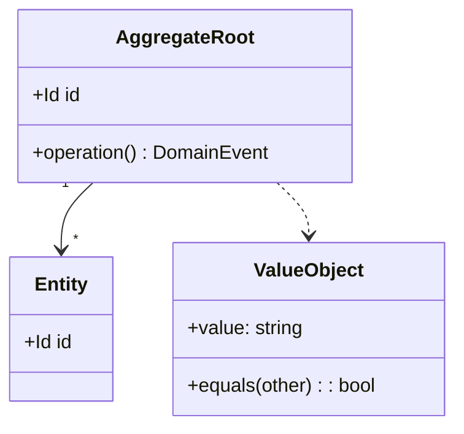
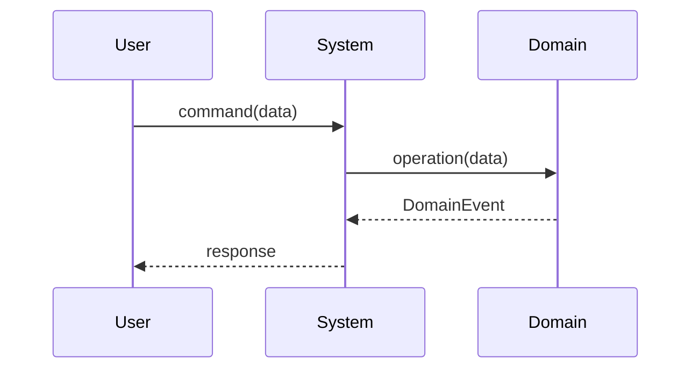

# DDD → BDD → TDD Development Flow

Follow these phases strictly in order. **Never advance to the next phase without user approval.**

---

## Phase 0: Orient — decide which bounded context this belongs to

**Do this before the interview.** Read, in this order:

1. `doc/README.md` — the index
2. `doc/system-context.md` — which bounded contexts exist and where the translators are
3. `doc/glossary.md` — the ubiquitous language
4. `doc/questions/open/` and `doc/questions/deferred/` — what is already
   known to be unknown, and what was deliberately left alone

Then answer one question: **which existing bounded context does this work belong to?**

> **The default answer is "an existing one."**
> Creating a new bounded context requires an ADR that shows **the ubiquitous
> language actually differs** — that the same word means something else, or that
> a translator (anti-corruption layer) has to sit at the boundary.
> **"This is a new feature" is not a reason.** Features are increments of work,
> not units of the domain.

A feature usually touches **more than one** context. That is normal. Split the
work by context and file each part in its own place. **Do not create a directory
named after the feature.**

Record the answer in the increment folder you create in Phase 1.

---

## Where everything lives

**Read this once; every phase below assumes it.** The shape is not arbitrary —
each file answers a different question, and things that answer the same question
live together, so there is one place to look and one place to change.

```
doc/
  system-context.md   S — the one system context diagram. **The contexts are counted from it**
  use-cases.md        U — the one list of use cases. IDs carry a context prefix
  glossary.md         the ubiquitous language, plus units and sentinels

  context/<bounded-context>/       one directory per party the system talks to
    domain-model.md   D — this context's language, aggregates, matching src
    object-model.md   O — the use cases it carries, and the interactions
    constraints.md    rules to obey + invariants, each linked to the test that holds it
    features/*.feature
```

Two rules follow. Both are worth stating plainly, because breaking either one is
the failure this layout exists to prevent.

**S and U are singletons.** One system context diagram, one use-case list, for the
whole repository. Phase 2 *updates* them; it never draws new ones.

**D, O and constraints are per context, one each.** Not one per aggregate, not one
per increment. A reader should open three files and have the whole design of a
context — and be able to trust that no fourth file is hiding somewhere.

Everything else is either not design, a record rather than a model, or material you
were given. **That part of the tree is in `references/layout.md`.**

**Every markdown file under `doc/` is an OKF concept.** `doc/` is written as an
[OKF](https://okf.md/spec/) knowledge bundle: each `.md` opens with YAML frontmatter
whose `type` names its role (`System Context`, `Domain Model`, `Evidence`, …) and
whose `description` says in one sentence what it holds. Phase 0 is an agent reading
this tree cold; with the role in frontmatter it — or any OKF-aware tool — can tell
what each file is, and whether to open it, without reading the body. **The type for
each file and the rules that go with it: `references/layout.md`.**

---

## Phase 1: Requirements Interview

Conduct a structured interview. Ask all questions before proceeding.

### Domain & Context
- What problem does this application/feature solve?
- Who are the primary users (actors)?
- What is the core domain? Are there supporting or generic subdomains?
- What are the key business rules and constraints?
- What are the acceptance criteria for success?

### Technical Context
- What technology stack will be used? (language, framework, DB, etc.)
- Are there existing systems to integrate with?
- Non-functional requirements: performance, security, scale, availability

Save the collected answers to **`doc/increments/<date>-<name>/requirements.md`**.

> **Do not overwrite **another increment's** `requirements.md`.** Each increment keeps its own record.
>
> Then **split the content four ways** and file each part where it belongs.
>
> | Content | Destination | Why |
> |---|---|---|
> | What you measured on the device | `doc/evidence/` | **Append only. Corrections go on a new line** |
> | Rules to obey | **append** to `doc/context/<bc>/constraints.md` | Revised. Old versions become void |
> | Acceptance criteria | the `.feature` files in Phase 3 | Fixed once implemented |
> | Open questions | a new file under `doc/questions/open/<subject>/` | **The directory is the status** |
> | New vocabulary | **append** to `doc/glossary.md` | **Everything goes through here** |

### Recording what you could not resolve

Anything you could not settle — an unknown, a number picked because one had to be
picked, a parameter nobody dared touch — goes to `doc/questions/`, one file per
question. **The `unresolved-questions` skill owns that workflow; use it rather
than inventing a format here.**

What matters for this phase: **do not carry an open question forward as a `TODO`
in the code or a sentence in `requirements.md`.** The increment folder freezes, and
a question frozen inside it stops being visible to anyone looking for open work.

**Branch Creation & First Commit**

Derive a kebab-case feature name from the Phase 1 answers (e.g., "User Authentication" → `user-authentication`). Add a row for this increment to the timeline in `doc/README.md` (date, name, contexts touched, link to the increment folder, Status `Phase 1 complete`). Create the root `README.md` only if the repository has none yet — see **README.md Lifecycle** below. Then:

```bash
git checkout -b feature/<new-feature-name>
git add doc/increments/ doc/glossary.md doc/questions/ doc/README.md
git commit -m "docs(phase1): add requirements for <new-feature-name>"
```

All subsequent work happens on this branch.

---

## Phase 2: SUDO Modeling (DDD)

**Do not draw a new S or U diagram.** The repository has exactly one of each.
**Update** `doc/system-context.md` and `doc/use-cases.md` instead.
**A second System Context diagram is a defect.**

Draw only D and O:

| | Where |
|---|---|
| **D** | append to `doc/context/<bc>/domain-model.md` |
| **O** | append to `doc/context/<bc>/object-model.md` |

> **Five kinds of design document, and no others: S, U, D, O, constraints.**
> S and U exist **once each** in the repository. D, O and constraints exist
> **once per context**. **Do not create a sixth kind, and do not add a second
> file of an existing kind.** One document answers one question.

> **The number of contexts is read off the S diagram.** A context exists for
> each party **the system itself** is connected to — no more. If your feature does not add
> a line to the S diagram, **it does not add a context.**

**Append under these headings.** A drift check reads them, so a document that
invents its own headings fails `npm test` — but the real reason is that a reader
should find the same thing in the same place in every context.

| File | Headings |
|---|---|
| `domain-model.md` | `## <the language here>` · `## <aggregates and value objects>` · `## <matching src>` |
| `object-model.md` | `## <the use cases this context carries>` · `## <interactions>` |
| `constraints.md` | `## <rules to obey>` · `## <invariants>` |

Each file links back to `system-context.md`; `object-model.md` also links to
`use-cases.md`. **Those two are the canonical lists — restate only this
context's rows, never redraw them.**

> **Diagram size is a hard limit.**
> **1 diagram = 1 aggregate (D) or 1 use case (O).**
> **If it exceeds 40 lines or 7 classes, split it.**
>
> Measured: unsplit D diagrams reached 152 / 109 / 106 lines and became unreadable.

SUDO stands for:
- **S**ituation: bounded contexts, subdomains, and their relationships
- **U**secase: actors and their use cases
- **D**omain model: aggregates, entities, value objects, domain events
- **O**bject interaction: key sequence/collaboration for each core use case

### S — Situation · U — Usecase — **update, do not draw**

Both already exist, once each. **There is no template here on purpose:**
a template invites a new diagram, and a new diagram is the defect.

| | File | What Phase 2 adds |
|---|---|---|
| **S** | `doc/system-context.md` | A new external party **only if the system genuinely talks to one.** That is also what would justify a new context |
| **U** | `doc/use-cases.md` | New rows, with the context prefix (`DEV-` / `INT-` / …) |

Then restate **only this context's rows** inside `object-model.md`. The full list
stays in `use-cases.md`. **Two copies of a list means one of them goes stale.**

> Measured: when each increment drew its own S, the same external system appeared
> under five names (`LLM` / `LM Studio`, `URX22` / `UR-22C`) and nobody noticed,
> because no two of the five were ever read side by side.

### D — Domain Model

Model aggregates, entities, value objects, and domain events.



### O — Object Interaction

Draw a sequence diagram for each core use case.



**→ Present all four diagrams to the user.**
Ask: "Does this model accurately represent the domain? What is missing or wrong?"

Iterate until the user explicitly approves. Append a `## Review Notes` section with each round of feedback.

**Commit after approval**

Set this increment's row in `doc/README.md` to `Phase 2 complete`. **Keep the root `README.md` under 100 lines.**

```bash
git add doc/context/ doc/system-context.md doc/use-cases.md doc/ADR/ doc/README.md
git commit -m "docs(phase2): add SUDO domain model"
```

---

## Phase 3: BDD Feature Writing

From the approved SUDO model, derive Gherkin feature files. One `.feature` file per major use case under `doc/context/<bc>/features/`.

### Coverage Checklist (mandatory for every use case)

- [ ] Happy path
- [ ] Boundary values
- [ ] Error / rejection cases
- [ ] Business rule violations
- [ ] Concurrent or idempotency edge cases

### Feature File Template

Use the Gherkin template in `references/templates.md`. Save to `doc/context/<bc>/features/<use-case-name>.feature`.

**→ Present all feature files to the user.**
Ask: "Do these scenarios fully capture the expected behavior? Are there missing cases?"

Iterate until the user explicitly approves.

**Commit after approval**

Set this increment's row in `doc/README.md` to `Phase 3 complete` and link the `.feature` files it added or changed.

```bash
git add doc/context/ doc/README.md
git commit -m "docs(phase3): add BDD feature files"
```

---

## Phase 4: Property-Based Tests

### 4a: Extract Properties

From each approved feature, derive invariants and properties. **Append** to the `## Invariants` section of `doc/context/<bc>/constraints.md`.

For every scenario, ask:
- **Post-condition invariant**: "After this operation, X must always hold"
- **Negative invariant**: "This operation must never produce Y"
- **Roundtrip**: "encode → decode yields the original"
- **Monotonic**: "Adding an item always increases the count"
- **Idempotent**: "Applying the operation twice is the same as applying it once"
- **Equivalence**: "Two different paths produce the same observable result"

Use the property table format in `references/templates.md`.

### 4b: Integration Tests (Property-Based)

Create `test/integration/<feature-name>.test.<ext>` for each feature.

Structure:
1. Define **generators / arbitraries** for valid domain inputs (use the project's PBT library: fast-check / hypothesis / QuickCheck / jqwik / proptest — match the stack)
2. For each property, write a property test with shrinking enabled
3. Include at least one **stateful property** (model-based) when the feature has mutable state

A fast-check example is in `references/templates.md`.

### 4c: E2E Tests (Property-Based)

Create `test/e2e/<feature-name>.e2e.<ext>` for each major user journey.

Structure:
1. Drive the **full stack** (API/UI → DB) — no mocking at the system boundary
2. Use property-based generation for varied but valid inputs
3. Assert system-level invariants: data consistency, API contract, idempotency

**Commit after Phase 4**

Set this increment's row in `doc/README.md` to `Phase 4 complete`. If this is the first property-based test in the repo, record the PBT library in `doc/testing-strategy.md`.

```bash
git add doc/context/ doc/testing-strategy.md test/integration/ test/e2e/ doc/README.md
git commit -m "test(phase4): add property-based integration and e2e tests"
```

---

## Phase 5: TDD Implementation (t_wada Style)

Follow **Red → Green → Refactor** strictly. One cycle at a time.

### 5a: Build the Test List

Before writing any code, enumerate all unit tests needed. Save to `doc/increments/<date>-<name>/test-list.md` (template in `references/templates.md`).

Write the full list in one pass. Do not start coding yet.

### 5b: TDD Cycle (one item at a time)

Work through the test list one item at a time:

**RED**
- Pick the next unchecked item from the test list
- Write ONE failing test in `test/unit/<module>.test.<ext>`
- The test must fail **for the right reason**: assertion failure, not compile error (fix compile errors first without making the test pass)
- Name the test as a specification: `"deposit: increases balance by the deposited amount"`
- Use Arrange-Act-Assert

**GREEN**
- Write the simplest code in `src/` that makes the test pass
- Hardcode if that is the simplest path ("fake it till you make it")
- Run all tests — the new test must pass, no existing test must regress

**REFACTOR**
- Remove duplication between test and implementation
- Improve names, simplify structure, extract abstractions only if warranted
- Run all tests — all must still pass
- Mark the item as `[x]` in the test list

Repeat until the test list is exhausted.

### 5c: Triangulation Rule

When the implementation is hardcoded (faked), add a **second test case** with a different concrete example before refactoring. The second case forces generalization without guessing.

```
First test:  deposit(100) → balance == 100   ← implementation returns 100 (faked)
Second test: deposit(200) → balance == 200   ← forces the real addition logic
Refactor:    implement `balance += amount`
```

### 5d: Integration Gate

After all unit tests pass:
1. Run the property-based integration tests from Phase 4b
2. Run the e2e tests from Phase 4c
3. **Run the documentation check** (`test/unit/documentation.test.ts`) — it catches
   the failure modes below mechanically: a stale premise still written as current
   fact, a broken link, an ID without a context prefix, a diagram grown past 40 lines,
   a `doc/` markdown file with no OKF `type`
4. Fix any failures with additional TDD cycles (add test to the list, loop)

**Then close out anything you answered.** Increments routinely settle questions
on the way past without anyone noticing, so check `doc/questions/open/` against
what you learned. **The `unresolved-questions` skill has the closing procedure** —
do it in this commit, not later. A question left in `open/` after it has been
answered is worse than no list at all: the next reader trusts it and re-investigates.

**Commit after integration gate passes**

Set this increment's row in `doc/README.md` to `Phase 5 complete`. Update the root `README.md` only if how to run the app or its tests changed.

```bash
git add src/ test/unit/ doc/increments/ doc/README.md README.md
git commit -m "feat(<scope>): implement <new-feature-name>"
```

---

## Architecture Decision Records (ADR)

Whenever a significant decision is made **in any phase**, record it immediately —
not batched at the end of the phase. A decision written a day later is a
rationalisation; the forces you felt at the time are the part worth keeping.

Write it as **`Proposed`**. It becomes `Accepted` only when the user explicitly
approves it — the Phase 2 and Phase 3 approval gates are the natural place to ask.
An intention such as "let's switch to X" is not approval.

**Format and the full list of triggers: `references/templates.md`.** If the
`adr-writing-ja` skill is available, follow it for placement, format, and the
argument check. File as `doc/ADR/NNNN-<kebab-case-title>.md`. When a decision is
later overturned, write the new ADR as `Proposed` with `Supersedes`; **only when it
is accepted, set the old ADR's `Status` to `Superseded by ADR-NNNN`**, never editing
its body — the chain is how a reader tells which version is current.

## Git Workflow

All development happens on a `feature/<new-feature-name>` branch created at the end of Phase 1. Commit at every phase boundary so that history mirrors the flow.

| Phase | Trigger | `doc/README.md` timeline row | Commit message |
|---|---|---|---|
| 1 — Requirements | After the increment folder is written | Add the row: date, name, contexts, link, Status | `docs(phase1): add requirements for <name>` |
| 2 — SUDO Model | After user explicitly approves | Status → Phase 2 | `docs(phase2): add SUDO domain model` |
| 3 — BDD Features | After user explicitly approves | Status → Phase 3, link `.feature` files | `docs(phase3): add BDD feature files` |
| 4 — Property Tests | After 4b + 4c test files generated | Status → Phase 4 | `test(phase4): add property-based integration and e2e tests` |
| 5 — Implementation | After integration gate passes (5d) | Status → Phase 5 (root `README.md` only if run/test commands changed) | `feat(<scope>): implement <name>` |

**Rules:**
- `doc/README.md` is staged and committed at every phase boundary — never skip it. The root `README.md` is committed only when it actually changed.
- Include ADR files (`doc/ADR/`) in the Phase 2 commit if any were created during modeling.
- Never commit in the middle of a Red-Green-Refactor cycle; always commit only after the Refactor step of the *last* item in the test list.
- Do not push until the user asks; the branch is local until then.

### README.md Lifecycle

**The root `README.md` is an entry point, not a record.** It says what the app is,
how to run it and its tests, and points at `doc/README.md` — under 100 lines, and
never a section per feature: once it accumulates those it stops being readable
(measured: it reached 722 lines). Per-increment status lives in its row of the
`doc/README.md` timeline; history lives in `doc/increments/`.
**Templates for both: `references/templates.md`.**

## The rest of the tree

Everything that is *not* a model — `doc/README.md`, `testing-strategy.md`, `questions/`,
`ADR/`, `reference/`, `evidence/`, `increments/`, `environment/` — and why `evidence/`,
`reference/`, and `increments/` are kept apart: `references/layout.md`.

---

## Key Principles

- **Phases are sequential.** Never skip or reverse.
- **User approval is a hard gate** before advancing past Phase 2 and Phase 3.
- **Tests document behavior**, not implementation. Test names read as sentences.
- **Small steps in TDD.** Each Red-Green-Refactor cycle should take minutes.
- **Property tests catch what example tests miss.** They are not optional.
- **All diagrams use Mermaid** — keeps documentation as plain text alongside code.
- **Decisions get an ADR immediately.** Every significant architectural choice is recorded in `doc/ADR/` as `Proposed` at the moment it is made, not after the phase ends, and becomes `Accepted` only on the user's explicit approval.

## Common Failures to Avoid

| Failure | Consequence | Prevention |
|---|---|---|
| Skipping the interview and guessing the domain | Wrong model, rework in Phase 3+ | Phase 1 is mandatory even when it "seems obvious" |
| Advancing past Phase 2 without user sign-off | Feature files based on a wrong model | Hard gate: explicit "approved" from user before Phase 3 |
| Writing tests that check implementation internals | Fragile tests that break on refactor | Test behavior and observable state, not internal calls |
| Implementing without a failing test first | Loses TDD's design-feedback loop | Write the test, watch it fail, only then write code |
| Writing all unit tests before any implementation | Waterfall in disguise; defeats TDD | One cycle at a time: test → code → refactor |
| Skipping property-based tests | Missing entire classes of counterexamples | Phase 4 is mandatory; example tests alone are insufficient |
| **Creating a directory per feature** | **Unrelated silos; the same fact frozen at different dates** | Phase 0: file the work in an existing bounded context |
| **Redrawing the S and U diagrams each time** | **The same external system drawn 5 times under 5 names; `UC-1` meaning 3 different things** | S and U are repository-wide singletons |
| **Writing `.feature` files nothing executes** | **Lines that look authoritative and are never checked** | Decide up front: make them executable, or add a drift check |
| **Splitting one context's design across many files** | **A reviewer starts by deciding which file to open** — one context reached 9 | Split by *role* (D / O / constraints), never by aggregate or by increment |
| **Naming a directory with a broad word** (`arch/`, `misc/`, `common/`) | **Things of different scope drift into it** — a repo-wide document sat under a context-specific prefix for weeks | Name it after the one role it holds. **Two lifetimes inside one directory is the signal to split** |
| **The same table in two documents** | One copy goes stale and nothing notices | **One fact, one home.** Everywhere else links to it |

## Related Skills

- `playwright-test` — for e2e tests in browser-driven projects
- `retrospective-codify` — codify insights from the TDD cycle as permanent rules
- `adr-writing-ja` — writing and superseding ADRs in Japanese
- `unresolved-questions` — filing and closing what an increment cannot settle
- `okf-open-knowledge-format` — the OKF format `doc/` is written in, and its validator
