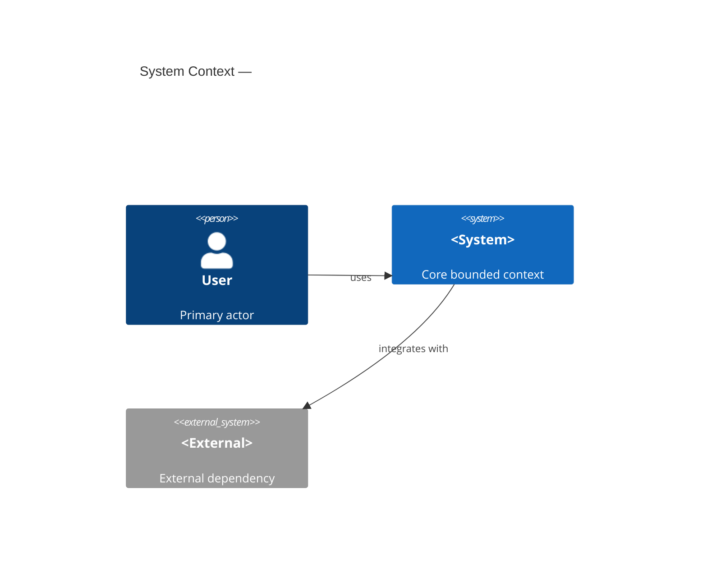
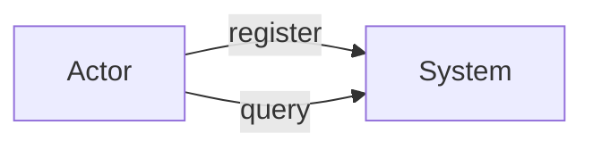
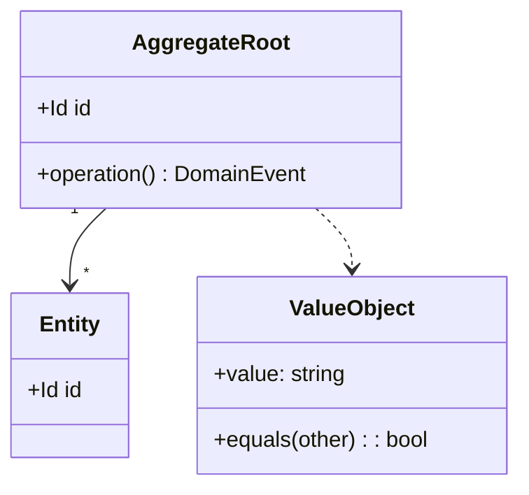
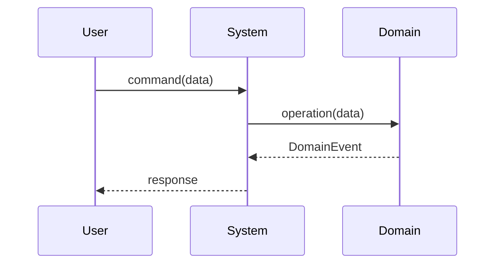

# DDD → BDD → TDD 開発フロー

各フェーズを必ず順番通りに実施する。**ユーザーの承認なしに次のフェーズへ進んではならない。**

---

## フェーズ 1: 要件ヒアリング

構造化インタビューを実施する。すべての質問を先に行ってから次に進む。

### ドメイン & コンテキスト
- このアプリ/機能が解決したい課題は何か？
- 主要なユーザー（アクター）は誰か？
- コアドメインは何か？サポーティング・汎用サブドメインはあるか？
- 主要なビジネスルールと制約は何か？
- 完了条件（受け入れ基準）は何か？

### 技術コンテキスト
- 使用する技術スタックは何か？（言語・フレームワーク・DB など）
- 連携が必要な既存システムはあるか？
- 非機能要件: パフォーマンス・セキュリティ・スケール・可用性

収集した回答を `doc/requirements.md` に保存する。

**ブランチ作成 & 初回コミット**

フェーズ 1 の回答からフィーチャー名を kebab-case で導出する（例: 「ユーザー認証」 → `user-authentication`）。ブランチを作成してから要件をコミットする:

```bash
git checkout -b feature/<new-feature-name>
git add doc/requirements.md
git commit -m "docs(phase1): add requirements for <new-feature-name>"
```

以降のすべての作業はこのブランチで行う。

---

## フェーズ 2: SUDO モデリング（DDD）

Mermaid ダイアグラムを 4 枚作成する。すべて `doc/sudo-model.md` に保存する。

SUDO の意味:
- **S**ituation（状況・文脈）: 境界付きコンテキスト、サブドメイン、それらの関係
- **U**secase（ユースケース）: アクターとそのユースケース
- **D**omain model（ドメインモデル）: 集約・エンティティ・値オブジェクト・ドメインイベント
- **O**bject interaction（オブジェクト相互作用）: 各コアユースケースの主要なシーケンス/コラボレーション

### S — Situation

境界付きコンテキスト、サブドメイン、外部システムの境界を可視化する。



### U — Usecase

ヒアリングから導いたすべてのアクターとユースケースを列挙する。



### D — Domain Model

集約・エンティティ・値オブジェクト・ドメインイベントをモデル化する。



### O — Object Interaction

各コアユースケースのシーケンス図を描く。



**→ 4 枚のダイアグラムをユーザーに提示する。**
「このモデルはドメインを正確に表現していますか？不足や誤りはありますか？」と確認する。

ユーザーが明示的に承認するまでイテレーションを繰り返す。各フィードバックラウンドを `## レビューノート` セクションに追記する。

**承認後にコミット**

```bash
git add doc/sudo-model.md doc/ADR/
git commit -m "docs(phase2): add SUDO domain model"
```

---

## フェーズ 3: BDD フィーチャー記述

承認済みの SUDO モデルから Gherkin フィーチャーファイルを導出する。主要なユースケースごとに `doc/features/` 配下に 1 つの `.feature` ファイルを作成する。

### カバレッジチェックリスト（すべてのユースケースで必須）

- [ ] ハッピーパス（正常系）
- [ ] 境界値
- [ ] エラー / 拒否ケース（異常系）
- [ ] ビジネスルール違反
- [ ] 並行処理・冪等性のエッジケース

### フィーチャーファイルテンプレート

```gherkin
Feature: <Use case name>
  As a <actor>
  I want to <action>
  So that <business value>

  Background:
    Given <common precondition>

  Scenario: Happy path — <name>
    Given <precondition>
    When <actor performs action>
    Then <expected outcome>
    And <additional assertion>

  Scenario: Error — <name>
    Given <invalid state>
    When <actor performs action>
    Then an error "<message>" is returned

  Scenario Outline: Boundary — <name>
    Given a <entity> with "<param>"
    When <action>
    Then the result is "<expected>"
    Examples:
      | param | expected |
      | ...   | ...      |
```

`doc/features/<use-case-name>.feature` に保存する。

**→ すべてのフィーチャーファイルをユーザーに提示する。**
「これらのシナリオは期待される振る舞いを完全に捉えていますか？不足しているケースはありますか？」と確認する。

ユーザーが明示的に承認するまでイテレーションを繰り返す。

**承認後にコミット**

```bash
git add doc/features/
git commit -m "docs(phase3): add BDD feature files"
```

---

## フェーズ 4: プロパティベーステスト

### 4a: プロパティの抽出

承認済みの各フィーチャーから不変条件とプロパティを導出する。`doc/properties.md` に文書化する。

各シナリオに対して以下を問う:
- **事後条件不変量**: 「この操作の後、X は常に成立しなければならない」
- **否定不変量**: 「この操作は決して Y を生成してはならない」
- **ラウンドトリップ**: 「encode → decode すると元に戻る」
- **単調性**: 「アイテムを追加すると常に件数が増える」
- **冪等性**: 「操作を 2 回適用しても 1 回と同じ結果になる」
- **等価性**: 「2 つの異なるパスが同じ観測可能な結果を生む」

`doc/properties.md` のフォーマット:

```markdown
## <Use case name>

| プロパティ | 種別 | 表現 |
|---|---|---|
| 残高が負にならない | 不変量 | `∀ deposit d: balance(after) ≥ 0` |
| シリアライズのラウンドトリップ | ラウンドトリップ | `decode(encode(x)) == x` |
```

### 4b: インテグレーションテスト（プロパティベース）

各フィーチャーに対して `test/integration/<feature-name>.test.<ext>` を作成する。

構造:
1. 有効なドメイン入力の**ジェネレーター / アービトラリー**を定義する（プロジェクトの PBT ライブラリを使用: fast-check / hypothesis / QuickCheck / jqwik / proptest — スタックに合わせる）
2. 各プロパティに対して、シュリンキング有効のプロパティテストを記述する
3. フィーチャーが可変状態を持つ場合は、**ステートフルプロパティ**（モデルベース）を少なくとも 1 つ含める

```typescript
// fast-check の例
import * as fc from "fast-check";

test("balance invariant: never negative after valid deposit", () => {
  fc.assert(
    fc.property(fc.integer({ min: 1, max: 1_000_000 }), (amount) => {
      const account = Account.empty();
      account.deposit(amount);
      expect(account.balance).toBeGreaterThanOrEqual(0);
    })
  );
});
```

### 4c: E2E テスト（プロパティベース）

主要なユーザージャーニーごとに `test/e2e/<feature-name>.e2e.<ext>` を作成する。

構造:
1. **フルスタック**（API/UI → DB）を駆動する — システム境界でのモックなし
2. 多様かつ有効な入力にプロパティベース生成を使用する
3. システムレベルの不変量をアサートする: データ整合性・API コントラクト・冪等性

**フェーズ 4 完了後にコミット**

```bash
git add doc/properties.md test/integration/ test/e2e/
git commit -m "test(phase4): add property-based integration and e2e tests"
```

---

## フェーズ 5: TDD 実装（t_wada スタイル）

**Red → Green → Refactor** を厳密に守る。1 サイクルずつ進める。

### 5a: テストリストの作成

コードを書く前に、必要なすべてのユニットテストを列挙する。`doc/test-list.md` に保存する:

```markdown
## テストリスト

- [ ] <シナリオ: ハッピーパス> — unit
- [ ] <シナリオ: エラーケース> — unit
- [ ] <エッジ: 境界値> — unit
- [ ] <エッジ: 不正入力> — unit
...
```

一気にリスト全体を書く。コーディングはまだ始めない。

### 5b: TDD サイクル（1 項目ずつ）

テストリストを 1 項目ずつ消化する:

**RED**
- テストリストの次の未チェック項目を選ぶ
- `test/unit/<module>.test.<ext>` に失敗するテストを 1 つ書く
- テストは**正しい理由で失敗**しなければならない: コンパイルエラーではなくアサーション失敗（コンパイルエラーは先に修正するが、テストを通してはいけない）
- テスト名は仕様として読めるようにする: `"deposit: increases balance by the deposited amount"`
- Arrange-Act-Assert を使う

**GREEN**
- `src/` にテストを通す最もシンプルなコードを書く
- 最もシンプルな道であればハードコードしてよい（"fake it till you make it"）
- すべてのテストを実行 — 新しいテストが通り、既存テストが退行しないこと

**REFACTOR**
- テストと実装の重複を除去する
- 名前を改善し、構造を簡潔にし、必要な場合のみ抽象を抽出する
- すべてのテストを実行 — すべて通ること
- テストリストの項目を `[x]` にする

テストリストが尽きるまで繰り返す。

### 5c: 三角測量ルール

実装がハードコード（フェイク）になっている場合、リファクタリング前に**2 つ目のテストケース**を異なる具体例で追加する。2 つ目のケースが汎化を強制し、推測を排除する。

```
最初のテスト:  deposit(100) → balance == 100   ← 実装が 100 を返す（フェイク）
2 つ目のテスト: deposit(200) → balance == 200   ← 本物の加算ロジックを強制する
リファクタリング: `balance += amount` を実装する
```

### 5d: インテグレーションゲート

すべてのユニットテストが通ったら:
1. フェーズ 4b のプロパティベースインテグレーションテストを実行する
2. フェーズ 4c の E2E テストを実行する
3. 失敗があれば追加の TDD サイクルで修正する（リストにテストを追加してループ）

**インテグレーションゲート通過後にコミット**

```bash
git add src/ test/unit/ doc/test-list.md
git commit -m "feat(<scope>): implement <new-feature-name>"
```

---

## アーキテクチャ決定記録（ADR）

いずれかのフェーズで重要なアーキテクチャ・設計上の決定が行われたときは、ADR として記録する。

**ADR を作成するタイミング:**
- 技術やフレームワークを選択したとき（例: 「SQLite より PostgreSQL を使う」）
- 設計パターンやアーキテクチャスタイルを採用したとき（例: 「Order 集約に CQRS を使う」）
- 既知のトレードオフを受け入れたとき
- 将来の読者のために却下した代替案を残す価値があるとき

**ファイル:** `doc/ADR/NNNN-<kebab-case-title>.md`（ゼロパディング 4 桁、例: `doc/ADR/0001-use-event-sourcing.md`）

**フォーマット（Nygard）:**

```markdown
# ADR-NNNN: <title>

## Status

Proposed | Accepted | Deprecated | Superseded by [ADR-NNNN](NNNN-<title>.md)

## Context

<この決定に至った状況・力・制約を記述する。>

## Decision

<能動態で決定を述べる: "We will…">

## Consequences

<この決定の正と負の帰結を列挙する。>
```

ADR はフェーズの終わりにまとめて作成するのではなく、決定が行われたその場で即座に作成する。ユーザーが後で決定を変更した場合は、古い ADR の `Status` を `Superseded by ADR-NNNN` に更新し、新しい ADR を作成する。

---

## Git ワークフロー

すべての開発はフェーズ 1 終了時に作成した `feature/<new-feature-name>` ブランチで行う。フェーズの区切りごとにコミットし、履歴がフローを正確に反映するようにする。

| フェーズ | コミットのタイミング | コミットメッセージ |
|---|---|---|
| 1 — 要件ヒアリング | `doc/requirements.md` 保存後 | `docs(phase1): add requirements for <name>` |
| 2 — SUDO モデル | ユーザーが明示的に承認後 | `docs(phase2): add SUDO domain model` |
| 3 — BDD フィーチャー | ユーザーが明示的に承認後 | `docs(phase3): add BDD feature files` |
| 4 — プロパティテスト | 4b + 4c のテストファイル生成後 | `test(phase4): add property-based integration and e2e tests` |
| 5 — 実装 | インテグレーションゲート通過後（5d） | `feat(<scope>): implement <name>` |

**ルール:**
- モデリング中に ADR を作成した場合は、フェーズ 2 のコミットに `doc/ADR/` を含める。
- Red-Green-Refactor サイクルの途中でコミットしない。テストリストの最後の項目の Refactor ステップが完了してからコミットする。
- ユーザーから指示があるまでプッシュしない。ブランチはそれまでローカルに留める。

---

## ファイル構造

```
doc/
  requirements.md           # フェーズ 1
  sudo-model.md             # フェーズ 2 (ダイアグラム + レビューノート)
  features/
    <use-case>.feature      # フェーズ 3
  properties.md             # フェーズ 4a
  test-list.md              # フェーズ 5a
  ADR/
    0001-<decision>.md      # 任意のフェーズ — 決定時に作成

test/
  unit/
    <module>.test.<ext>     # フェーズ 5b
  integration/
    <feature>.test.<ext>    # フェーズ 4b
  e2e/
    <feature>.e2e.<ext>     # フェーズ 4c

src/
  <module>.<ext>            # フェーズ 5
```

---

## 重要原則

- **フェーズは順次実行。** スキップや逆行は禁止。
- **ユーザーの承認はハードゲート。** フェーズ 2 とフェーズ 3 を通過する前に必須。
- **テストは振る舞いを文書化する。** 実装ではない。テスト名は文として読める。
- **TDD は小さいステップで。** 各 Red-Green-Refactor サイクルは数分以内に完了すること。
- **プロパティテストはサンプルテストが見落とすものを捕捉する。** 省略不可。
- **すべてのダイアグラムは Mermaid を使用。** コードと並んでプレーンテキストとして管理する。
- **決定はその場で ADR に記録。** 重要なアーキテクチャ上の選択はすべて、フェーズ終了後ではなく決定した瞬間に `doc/ADR/` に Nygard フォーマットで記録する。

## よくある失敗

| 失敗 | 影響 | 防止策 |
|---|---|---|
| インタビューをスキップしてドメインを推測する | 誤ったモデル、フェーズ 3 以降でやり直し | 「明らか」に見えてもフェーズ 1 は必須 |
| フェーズ 2 でユーザーのサインオフなしに進む | 誤ったモデルに基づくフィーチャーファイル | ハードゲート: フェーズ 3 前にユーザーの明示的な「承認」が必要 |
| 実装内部をチェックするテストを書く | リファクタリングで壊れる脆いテスト | 振る舞いと観測可能な状態をテストし、内部呼び出しはテストしない |
| 失敗するテストなしに実装する | TDD の設計フィードバックループを失う | テストを書き、失敗を確認し、それからコードを書く |
| 実装前にすべてのユニットテストを書く | 擬似ウォーターフォール、TDD を無効化する | 1 サイクルずつ: テスト → コード → リファクタリング |
| プロパティベーステストをスキップする | 反例のクラス全体を見落とす | フェーズ 4 は必須。サンプルテストだけでは不十分 |

## 関連スキル

- `playwright-test` — ブラウザ駆動プロジェクトの E2E テスト
- `retrospective-codify` — TDD サイクルから得た洞察を恒久的なルールとして記録
