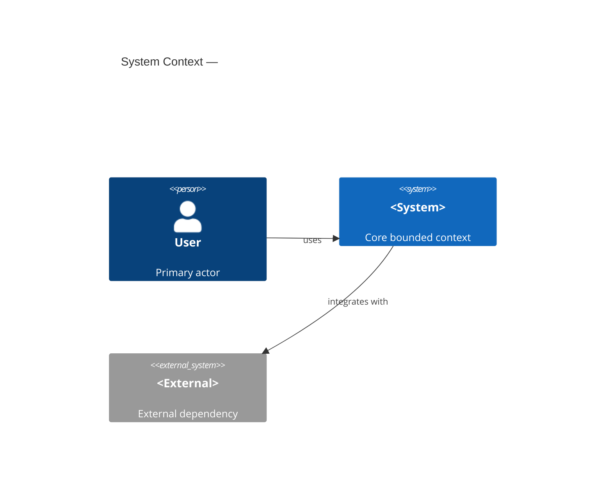
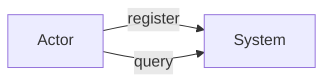
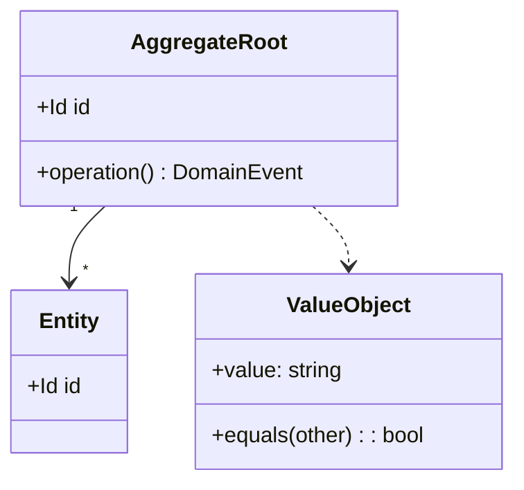
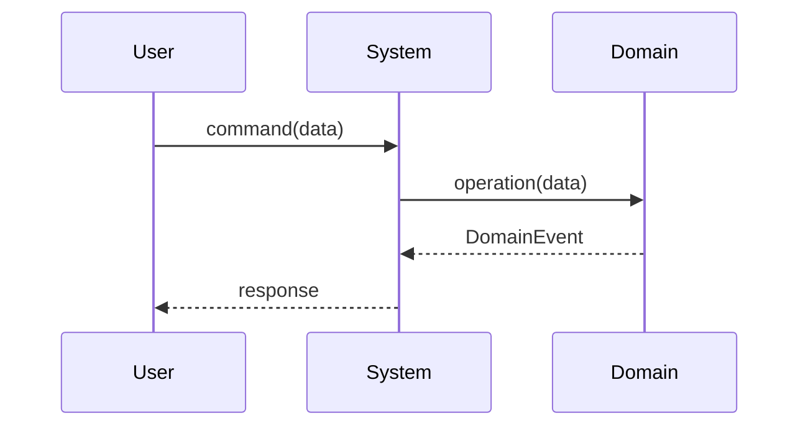

# DDD → BDD → TDD Development Flow

Follow these phases strictly in order. **Never advance to the next phase without user approval.**

---

## Phase 1: Requirements Interview

Conduct a structured interview. Ask all questions before proceeding.

### Domain & Context
- What problem does this application/feature solve?
- Who are the primary users (actors)?
- What is the core domain? Are there supporting or generic subdomains?
- What are the key business rules and constraints?
- What are the acceptance criteria for success?

### Technical Context
- What technology stack will be used? (language, framework, DB, etc.)
- Are there existing systems to integrate with?
- Non-functional requirements: performance, security, scale, availability

Save the collected answers to `doc/requirements.md`.

**Branch Creation & First Commit**

Derive a kebab-case feature name from the Phase 1 answers (e.g., "User Authentication" → `user-authentication`). Create `README.md` using the template from the **README.md Lifecycle** section below — fill in the feature name, one-line description, Overview, and set Status to `Phase 1 complete`. Then:

```bash
git checkout -b feature/<new-feature-name>
git add doc/requirements.md README.md
git commit -m "docs(phase1): add requirements for <new-feature-name>"
```

All subsequent work happens on this branch.

---

## Phase 2: SUDO Modeling (DDD)

Create four Mermaid diagrams. Save all to `doc/sudo-model.md`.

SUDO stands for:
- **S**ituation: bounded contexts, subdomains, and their relationships
- **U**secase: actors and their use cases
- **D**omain model: aggregates, entities, value objects, domain events
- **O**bject interaction: key sequence/collaboration for each core use case

### S — Situation

Visualize bounded contexts, subdomains, and external system boundaries.



### U — Usecase

List every actor and use case derived from the interview.



### D — Domain Model

Model aggregates, entities, value objects, and domain events.



### O — Object Interaction

Draw a sequence diagram for each core use case.



**→ Present all four diagrams to the user.**
Ask: "Does this model accurately represent the domain? What is missing or wrong?"

Iterate until the user explicitly approves. Append a `## Review Notes` section with each round of feedback.

**Commit after approval**

Update `README.md`: fill in the **Domain Model** section with a link to `doc/sudo-model.md` and a one-line summary per SUDO diagram. Set Status to `Phase 2 complete`.

```bash
git add doc/sudo-model.md doc/ADR/ README.md
git commit -m "docs(phase2): add SUDO domain model"
```

---

## Phase 3: BDD Feature Writing

From the approved SUDO model, derive Gherkin feature files. One `.feature` file per major use case under `doc/features/`.

### Coverage Checklist (mandatory for every use case)

- [ ] Happy path
- [ ] Boundary values
- [ ] Error / rejection cases
- [ ] Business rule violations
- [ ] Concurrent or idempotency edge cases

### Feature File Template

```gherkin
Feature: <Use case name>
  As a <actor>
  I want to <action>
  So that <business value>

  Background:
    Given <common precondition>

  Scenario: Happy path — <name>
    Given <precondition>
    When <actor performs action>
    Then <expected outcome>
    And <additional assertion>

  Scenario: Error — <name>
    Given <invalid state>
    When <actor performs action>
    Then an error "<message>" is returned

  Scenario Outline: Boundary — <name>
    Given a <entity> with "<param>"
    When <action>
    Then the result is "<expected>"
    Examples:
      | param | expected |
      | ...   | ...      |
```

Save to `doc/features/<use-case-name>.feature`.

**→ Present all feature files to the user.**
Ask: "Do these scenarios fully capture the expected behavior? Are there missing cases?"

Iterate until the user explicitly approves.

**Commit after approval**

Update `README.md`: fill in the **Features / Behavior** section with a table of `.feature` files and their descriptions. Set Status to `Phase 3 complete`.

```bash
git add doc/features/ README.md
git commit -m "docs(phase3): add BDD feature files"
```

---

## Phase 4: Property-Based Tests

### 4a: Extract Properties

From each approved feature, derive invariants and properties. Document in `doc/properties.md`.

For every scenario, ask:
- **Post-condition invariant**: "After this operation, X must always hold"
- **Negative invariant**: "This operation must never produce Y"
- **Roundtrip**: "encode → decode yields the original"
- **Monotonic**: "Adding an item always increases the count"
- **Idempotent**: "Applying the operation twice is the same as applying it once"
- **Equivalence**: "Two different paths produce the same observable result"

Format in `doc/properties.md`:

```markdown
## <Use case name>

| Property | Type | Expression |
|---|---|---|
| Balance never goes negative | Invariant | `∀ deposit d: balance(after) ≥ 0` |
| Roundtrip serialization | Roundtrip | `decode(encode(x)) == x` |
```

### 4b: Integration Tests (Property-Based)

Create `test/integration/<feature-name>.test.<ext>` for each feature.

Structure:
1. Define **generators / arbitraries** for valid domain inputs (use the project's PBT library: fast-check / hypothesis / QuickCheck / jqwik / proptest — match the stack)
2. For each property, write a property test with shrinking enabled
3. Include at least one **stateful property** (model-based) when the feature has mutable state

```typescript
// fast-check example
import * as fc from "fast-check";

test("balance invariant: never negative after valid deposit", () => {
  fc.assert(
    fc.property(fc.integer({ min: 1, max: 1_000_000 }), (amount) => {
      const account = Account.empty();
      account.deposit(amount);
      expect(account.balance).toBeGreaterThanOrEqual(0);
    })
  );
});
```

### 4c: E2E Tests (Property-Based)

Create `test/e2e/<feature-name>.e2e.<ext>` for each major user journey.

Structure:
1. Drive the **full stack** (API/UI → DB) — no mocking at the system boundary
2. Use property-based generation for varied but valid inputs
3. Assert system-level invariants: data consistency, API contract, idempotency

**Commit after Phase 4**

Update `README.md`: fill in the **Testing** section with the PBT library used and links to `test/integration/` and `test/e2e/`. Set Status to `Phase 4 complete`.

```bash
git add doc/properties.md test/integration/ test/e2e/ README.md
git commit -m "test(phase4): add property-based integration and e2e tests"
```

---

## Phase 5: TDD Implementation (t_wada Style)

Follow **Red → Green → Refactor** strictly. One cycle at a time.

### 5a: Build the Test List

Before writing any code, enumerate all unit tests needed. Save to `doc/test-list.md`:

```markdown
## Test List

- [ ] <scenario: happy path> — unit
- [ ] <scenario: error case> — unit
- [ ] <edge: boundary value> — unit
- [ ] <edge: invalid input> — unit
...
```

Write the full list in one pass. Do not start coding yet.

### 5b: TDD Cycle (one item at a time)

Work through the test list one item at a time:

**RED**
- Pick the next unchecked item from the test list
- Write ONE failing test in `test/unit/<module>.test.<ext>`
- The test must fail **for the right reason**: assertion failure, not compile error (fix compile errors first without making the test pass)
- Name the test as a specification: `"deposit: increases balance by the deposited amount"`
- Use Arrange-Act-Assert

**GREEN**
- Write the simplest code in `src/` that makes the test pass
- Hardcode if that is the simplest path ("fake it till you make it")
- Run all tests — the new test must pass, no existing test must regress

**REFACTOR**
- Remove duplication between test and implementation
- Improve names, simplify structure, extract abstractions only if warranted
- Run all tests — all must still pass
- Mark the item as `[x]` in the test list

Repeat until the test list is exhausted.

### 5c: Triangulation Rule

When the implementation is hardcoded (faked), add a **second test case** with a different concrete example before refactoring. The second case forces generalization without guessing.

```
First test:  deposit(100) → balance == 100   ← implementation returns 100 (faked)
Second test: deposit(200) → balance == 200   ← forces the real addition logic
Refactor:    implement `balance += amount`
```

### 5d: Integration Gate

After all unit tests pass:
1. Run the property-based integration tests from Phase 4b
2. Run the e2e tests from Phase 4c
3. Fix any failures with additional TDD cycles (add test to the list, loop)

**Commit after integration gate passes**

Update `README.md`: fill in the **Usage** and **Development** sections (how to run the app and tests). Set Status to `Phase 5 complete`. Remove any placeholder comments left in earlier phases.

```bash
git add src/ test/unit/ doc/test-list.md README.md
git commit -m "feat(<scope>): implement <new-feature-name>"
```

---

## Architecture Decision Records (ADR)

Whenever a significant architectural or design decision is made during any phase, record it as an ADR.

**When to create an ADR:**
- A technology or framework is chosen (e.g., "use PostgreSQL over SQLite")
- A design pattern or architectural style is adopted (e.g., "CQRS for the Order aggregate")
- A trade-off is accepted with known consequences
- A rejected alternative is worth preserving for future readers

**File:** `doc/ADR/NNNN-<kebab-case-title>.md` (zero-padded four-digit number, e.g. `doc/ADR/0001-use-event-sourcing.md`)

**Format (Nygard):**

```markdown
# ADR-NNNN: <title>

## Status

Proposed | Accepted | Deprecated | Superseded by [ADR-NNNN](NNNN-<title>.md)

## Context

<Describe the situation, forces, and constraints that led to this decision.>

## Decision

<State the decision in active voice: "We will…">

## Consequences

<List positive and negative consequences of this decision.>
```

Create the ADR immediately when the decision is made — do not batch them at the end of a phase. If the user later changes a decision, update the old ADR's `Status` to `Superseded by ADR-NNNN` and create a new one.

---

## Git Workflow

All development happens on a `feature/<new-feature-name>` branch created at the end of Phase 1. Commit at every phase boundary so that history mirrors the flow.

| Phase | Trigger | README.md update | Commit message |
|---|---|---|---|
| 1 — Requirements | After `doc/requirements.md` saved | Create: name, description, Overview, Status | `docs(phase1): add requirements for <name>` |
| 2 — SUDO Model | After user explicitly approves | Add: Domain Model section | `docs(phase2): add SUDO domain model` |
| 3 — BDD Features | After user explicitly approves | Add: Features / Behavior section | `docs(phase3): add BDD feature files` |
| 4 — Property Tests | After 4b + 4c test files generated | Add: Testing section | `test(phase4): add property-based integration and e2e tests` |
| 5 — Implementation | After integration gate passes (5d) | Add: Usage + Development sections, remove placeholders | `feat(<scope>): implement <name>` |

**Rules:**
- `README.md` is always staged and committed at every phase boundary — never skip it.
- Include ADR files (`doc/ADR/`) in the Phase 2 commit if any were created during modeling.
- Never commit in the middle of a Red-Green-Refactor cycle; always commit only after the Refactor step of the *last* item in the test list.
- Do not push until the user asks; the branch is local until then.

### README.md Lifecycle

`README.md` lives in the repo root. It is created in Phase 1 and gains a new section at each subsequent phase. Use this progressive template — fill in only what the current phase covers; leave the rest as comments until that phase is reached:

````markdown
# <Feature Name>

> <one-line description from Phase 1>

## Status

Phase N complete — <phase name>

## Overview

<Problem statement and acceptance criteria — filled in Phase 1>

## Domain Model

<!-- Added in Phase 2 -->
[SUDO model](doc/sudo-model.md) — <one-line summary of S/U/D/O diagrams>

## Features / Behavior

<!-- Added in Phase 3 -->
| Feature file | Description |
|---|---|
| [name.feature](doc/features/name.feature) | ... |

## Testing

<!-- Added in Phase 4 -->
- **Property tests (integration):** `test/integration/` — uses <PBT library>
- **Property tests (e2e):** `test/e2e/` — full-stack, no mocks

## Usage

<!-- Added in Phase 5 -->
<How to run the application or feature>

## Development

<!-- Added in Phase 5 -->
<How to build and run all tests>
````

Remove placeholder comments as each section is filled in. By Phase 5 the README must have no remaining comment placeholders.

---

## File Structure

```
doc/
  requirements.md           # Phase 1
  sudo-model.md             # Phase 2 (diagrams + review notes)
  features/
    <use-case>.feature      # Phase 3
  properties.md             # Phase 4a
  test-list.md              # Phase 5a
  ADR/
    0001-<decision>.md      # Any phase — created when a decision is made

test/
  unit/
    <module>.test.<ext>     # Phase 5b
  integration/
    <feature>.test.<ext>    # Phase 4b
  e2e/
    <feature>.e2e.<ext>     # Phase 4c

src/
  <module>.<ext>            # Phase 5
```

---

## Key Principles

- **Phases are sequential.** Never skip or reverse.
- **User approval is a hard gate** before advancing past Phase 2 and Phase 3.
- **Tests document behavior**, not implementation. Test names read as sentences.
- **Small steps in TDD.** Each Red-Green-Refactor cycle should take minutes.
- **Property tests catch what example tests miss.** They are not optional.
- **All diagrams use Mermaid** — keeps documentation as plain text alongside code.
- **Decisions get an ADR immediately.** Every significant architectural choice is recorded in `doc/ADR/` in Nygard format at the moment it is made, not after the phase ends.

## Common Failures to Avoid

| Failure | Consequence | Prevention |
|---|---|---|
| Skipping the interview and guessing the domain | Wrong model, rework in Phase 3+ | Phase 1 is mandatory even when it "seems obvious" |
| Advancing past Phase 2 without user sign-off | Feature files based on a wrong model | Hard gate: explicit "approved" from user before Phase 3 |
| Writing tests that check implementation internals | Fragile tests that break on refactor | Test behavior and observable state, not internal calls |
| Implementing without a failing test first | Loses TDD's design-feedback loop | Write the test, watch it fail, only then write code |
| Writing all unit tests before any implementation | Waterfall in disguise; defeats TDD | One cycle at a time: test → code → refactor |
| Skipping property-based tests | Missing entire classes of counterexamples | Phase 4 is mandatory; example tests alone are insufficient |

## Related Skills

- `playwright-test` — for e2e tests in browser-driven projects
- `retrospective-codify` — codify insights from the TDD cycle as permanent rules
